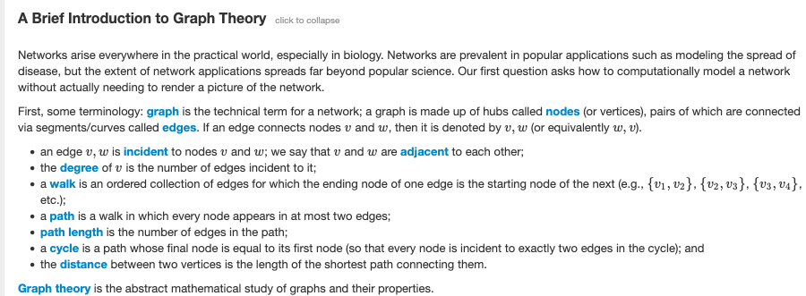

[This](https://rosalind.info/problems/grph/) problem asks:

> **Given**: A collection of DNA strings in FASTA format having total length at most 10 kbp.

> **Return**: The adjacency list corresponding to O3. You may return edges in any order.

<!--Break-->

# Restate the problem
The little paragraphs that Project Rosalind uses for introductions and problem statements are some of the densest bits of text I've ever seen. Consider the following "Brief Introduction to Graph Theory":

[Graph theory](https://en.wikipedia.org/wiki/Graph_theory) is a massive topic. How well do I need to understand graph theory to solve this problem? They don't say, but I'm not able to restate the problem in my own words without spending considerable time looking up words and reading wikipedia pages. The following topics were required to restate the problem:
1. [Adjacency list](https://en.wikipedia.org/wiki/Adjacency_list)
2. [Directed graph](https://en.wikipedia.org/wiki/Directed_graph)
3. [Overlap graph](https://rosalind.info/glossary/overlap-graph/)

They're going to send me a set of DNA strings in [FASTA format](https://en.wikipedia.org/wiki/FASTA_format). I need to return, in any order, every instance where the first three values in one string are the last three values in the second string.

# Solution steps
On a **personal note**, I need to make note of the fact that this is the first challenge where I feel like I'm starting from scratch. In the previous challenges, I remembered some or all of the process I went through to solve these back in 2018. Not so with this one. Project Rosalind says I solved this on March 6, 2018 at 8:18 a.m., but I have absolutely no memory of this.

nested for loops won't nest
I had not written my read_fasta method correctly, had not returned a list
returned a good-looking solution that was wrong
forgot to put the line break in the output file after each record

# Python concepts
iterators and lists
print statements for debugging
string slicing
efficiency

# Bioinformatics concepts
more on fasta format
graph theory
directionality

