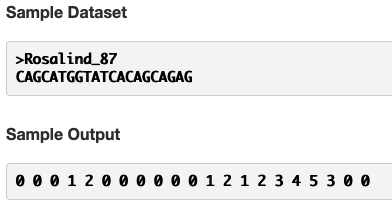

[This](https://rosalind.info/problems/kmp/) problem asks:

> **Given**: A DNA string s.

> **Return**: The failure array of s.

<!--break-->

# Required reading
1. [Failure array](https://rosalind.info/glossary/failure-array/)
2. [Knuth–Morris–Pratt algorithm](https://en.wikipedia.org/wiki/Knuth%E2%80%93Morris%E2%80%93Pratt_algorithm)

# Restate the problem
The Knuth-Morris-Pratt algorithm is an advancement in the efficiency of finding a substring within a given string. The central improvement over considering each individual character in the string as a possible beginning of the substring is that the Knuth-Morris-Pratt algorithm keeps track of partial successful matches. If a section of the string matches the substring, but then fails to match midway through, the Knuth-Morris-Pratt algorithm doesn't start over with the next character in the string. Instead, it skips ahead to the first character that could possibly be a start of the substring.

For this challenge, I'm going to get a DNA string, _s_. I need to return a [failure array](https://rosalind.info/glossary/failure-array/) of integers the same size as _s_. Every number in the failure array is the count of characters at that point in the string _s_ that match the beginning of the string _s_.

The sample dataset and sample output are helpful in understanding what's being asked here.

The first value in a failure array is always 0. We're given that value in the problem statement. The second value is a 0 because A, the second character, does not match C, the first character.

The third value is 0 because G, the third character, does not match C, the first character.

The fourth value is 1 because C, the fourth character, matches C, the first character.

The fifth value is 2 because A, the fifth character, matches A, the second character.

The sixth value is 0 because T, the sixth character, does not match G, the third character.

... and so on.

# Solution steps
First, I read in the DNA string and create a **result** array that's the same length as the DNA string with a 0 in every position.
Then I start with the second value in the string and increment that value by 1 if it matches the start of the string.
Then I continue iterating through the string and incrementing the positions in the failure array every time there is a match between the current character and the next character from the beginning of the string.
At the end, I throw out the first value in the array and add a 0 at the end. Why?

# Python concepts

# Bioinformatics concepts