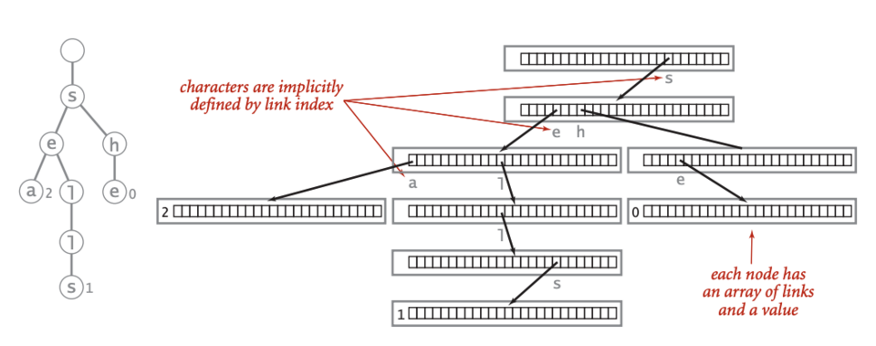

Trie representation from [Wikipedia](https://en.wikipedia.org/wiki/File:Trie_representation.png)

[This](https://rosalind.info/problems/trie/) problem asks:

> **Given**: A list of at most 100 DNA strings of length at most 100 bp, none of which is a prefix of another.

> **Return**: The adjacency list corresponding to the trie T for these patterns, in the following format. If T has n nodes, first label the root with 1 and then label the remaining nodes with the integers 2 through n in any order you like. Each edge of the adjacency list of T will be encoded by a triple containing the integer representing the edge's parent node, followed by the integer representing the edge's child node, and finally the symbol labeling the edge.

<!--break-->

# References
1. [Trie, pronounced "try"](https://rosalind.info/glossary/trie/)
2. [More on Tries](https://en.wikipedia.org/wiki/Trie)
3. [Implementing a Trie in Python](https://www.aleksandrhovhannisyan.com/blog/python-trie-data-structure/)

# Restate the problem
In order to solve this, I'm going to implement a prefix-tree or "Trie" data structure in Python. I'll focus on creating the structure, adding words, and crawling the trie because I won't need to edit existing tries or delete nodes from tries to solve this challenge.

I need to build the data structure for the list of strings I get from Project Rosalind, then crawl the trie and produce the output format: parent node id, child node id, leading edge symbol.

# Solution steps
First, I defined a Python class for each node.
```python
class TrieNode:
    def __init__(self, text = ''):
        self.text = text
        self.children = dict()
```


# Python concepts
Classes in Python
OOP in general


# Bioinformatics concepts