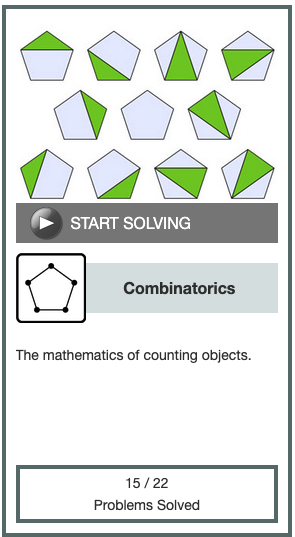

[Wikipedia illustration of 21 ways to draw non-intersecting chords between 5 points on a circle.](https://en.wikipedia.org/wiki/File:MotzkinChords5.svg)

[This](https://rosalind.info/problems/motz/) problem asks:

> **Given**: An RNA string s of length at most 300 bp.

> **Return**: The total number of noncrossing matchings of basepair edges in the bonding graph of s, modulo 1,000,000.

<!--break-->

# References
1. [Motzkin numbers](https://rosalind.info/glossary/motzkin-numbers/)
2. [More on Motzkin numbers](https://en.wikipedia.org/wiki/Motzkin_number)
3. [Theodore Motzkin](https://en.wikipedia.org/wiki/Theodore_Motzkin)
4. [Recurrence relations](https://en.wikipedia.org/wiki/Recurrence_relation)

# Restating the problem
Given an RNA strand up to 300 bp long, _s_, I need to count the total number of ways to match basepair edges that don't cross in the bonding graph of _s_. This is going to be an extremely large number, so I'm to return my result modulo 1,000,000.

# Solution steps
First, this problem is similar to [the Catalan numbers problem](https://rosalind.info/problems/cat/), where we had to find the number of noncrossing matches that were complete, meaning they included all nodes. This problem doesn't have that requirement. Here, every noncrossing matching counts, even the case where no base pairs match.

I started by copying my code from the Catalan problem, [here](https://github.com/rmbryan71/rosalind/blob/main/solution-code/cat.py).

I studied the differences between the Catalan problem and this Motzkin problem in detail. I realized that while the concepts for the two problems were similar, coding the two different recurrence relations in Python was quite different, so I started this problem again from scratch.

The problem description gives the recurrence relation for this situation as:
> mn=mn−1+∑nk=2mk−2⋅mn−k

I coded that like this:
```python
...
return (
            motzkin(dna[1:])
            + sum(
                motzkin(dna[1:m]) * motzkin(dna[m + 1 :])
                for m in range(1, len(dna))
                if isComplement(dna[0], dna[m])
            )
            % 1000000
        )
```

This gave the correct result for the sample dataset.

On my first attempt at a real dataset from Project Rosalind, my code did not return a result before the 5-minute timer ran out. I let the code run a few more minutes after that, but it didn't finish. The DNA string I received from Project Rosalind was 262 characters long. To put that into perspective, you can see how quickly the Motzkin numbers escalate by seeing a list of the Motzkin numbers themselves [here](https://oeis.org/A001006/b001006.txt).

I decided to memoize my function by storing the calculated values for each DNA string in a dictionary, then looking for a stored value first instead of calculating the value again. I was about 45 minutes into that process when I learned that Python has a module called [functools](https://docs.python.org/3/library/functools.html) that does a lot of this work.

From reading the documentation, it looked to me like @functools.cache as a good fit for my situation, so I tried importing the function from library and [decorating](https://w3schools.tech/tutorial/python/python_decorators) my code with it like this:

```python
@cache
def motzkin(dna):
    if len(dna) == 1:
        return 1
    if len(dna) == 0:
        return 1
    else:
        ...
```

With the @cache function in place, my code ran on the large dataset and returned a result almost instantly. It took less than a second.

My second attempt at a real dataset ran quickly, but returned an incorrect result. The first thing I noticed about my incorrect result is that it was larger than 1,000,000, which can't be true if I'm applying mod 1,000,000 correctly, so I started debugging from there.

I kept the motzkin function as it was, but applied a mod 1,000,000 when printing the result.

That code returned a correct result! The DNA string I got from Project Rosalind for this third attempt was 288 character long. It took me about two hours to solve this one. 1,010 people solved this before me, which marks a kind of milestone. There are no remaining problems that have been solved by more than 1,000 people in the 12+ year history of Project Rosalind. I was the first person to solve this challenge in 4 days. This was my 62nd correct result.

I also unlocked the Combinatorics badge level 3, shown below, for solving 15 of the 22 combinatorics problems in the set.

