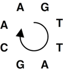

A circular DNA string

[This](https://rosalind.info/problems/pcov/) problem asks:

> **Given**: A collection of (error-free) DNA _k_-mers (_k_≤50) taken from the same strand of a circular chromosome. In this dataset, all k-mers from this strand of the chromosome are present, and their de Bruijn graph consists of exactly one simple cycle.

> **Return**: A cyclic superstring of minimal length containing the reads (thus corresponding to a candidate cyclic chromosome).

<!--break-->

# References
1. [Perfect coverage](https://rosalind.info/glossary/perfect-coverage/)
2. [Circular string](https://rosalind.info/glossary/circular-string/)
3. [de Bruijn graph](https://rosalind.info/glossary/de-bruijn-graph/)
4. [More on de Bruijn graph](https://en.wikipedia.org/wiki/De_Bruijn_graph)
5. [Simple cycle](https://en.wikipedia.org/wiki/Cycle_(graph_theory))

# Restating the problem
Given a list of DNA fragments, I need to construct the shortest possible cyclic superstring for all the given fragments.

# Solution steps
I started with this set of code that reads the DNA fragments and naively constructs a cyclic superstring by adding the two strings together if the second string is not already present in a cyclic form of the first.

```python
def add_cyclic(s, t):
    if len(s) < len(t):
        return False
    s1 = s + s
    if t in s1:
        return s
    return s + t


if __name__ == "__main__":
    file_path = "/Users/robertbryan/Downloads/rosalind_pcov_sample.txt"
    reads = []
    with open(file_path) as file:
        for line in file:
            reads.append(line.strip())
    response = reads[0]
    for i in range(1, len(reads)):
        response = add_cyclic(response, reads[i])
    print(response)
```

For the sample dataset:

```text
ATTAC
TACAG
GATTA
ACAGA
CAGAT
TTACA
AGATT
```

My first draft of code constructs the following cyclic superstring:

> ATTACTACAGTTACAAGATT

The shortest cyclic superstring for the sample dataset is:

> GATTACA


# Python concepts

# Bioinformatics concepts

# Post-solution notes
**Challenges solved so far:** 

**How many people solved this before me:** 

**Most recent solve before me:** 

**Time spent on challenge:** 

**Most time-consuming facet:** 

**Questions from others:** 

**Solutions from others:**

**Problem explanation:** 

**Accomplishments and badges:** 

**Closing thoughts:** 