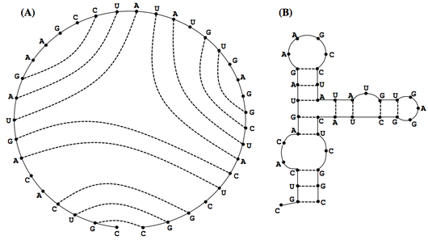
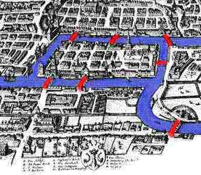

[This](https://rosalind.info/problems/rnas/) problem asks:

> **Given**: An RNA string _s_ (of length at most 200 bp).

> **Return**: The total number of distinct valid matchings of basepair edges in the bonding graph of _s_. Assume that wobble base pairing is allowed.

<!--break-->

# References
1. [Wobble base pair](https://rosalind.info/glossary/wobble-base-pair/)
2. [More on wobble base pair](https://en.wikipedia.org/wiki/Wobble_base_pair)
3. [Nucleic acid secondary structure](https://en.wikipedia.org/wiki/Nucleic_acid_secondary_structure)
4. [Valid basepair matching](https://en.wikipedia.org/wiki/Nucleic_acid_secondary_structure)

# Restating the problem
I'm going to get an RNA string. I need to calculate the number of distinct valid matchings of basepair edges.
This is the same calculation required in "[Motzkin Numbers and RNA Secondary Structures](https://rosalind.info/problems/motz/)" with two important exceptions:
1. Wobble bonding is allowed here, so uracil can bond with guanine.
2. Basepair edge bondings must have at least 3 non-bonding pairs between them.

# Solution steps
First, I copied [my code](https://github.com/rmbryan71/rosalind/blob/main/solution-code/motz.py) from the Motzkin numbers challenge to start my work here.

I edited the copied code to stop returning the result mod 1,000,000 because that is not required here. I also changed the read function to handle plain text because this challenge does not use FASTA format.

With those changes, my code ran against the sample dataset and returned a result.

The sample dataset:

> AUGCUAGUACGGAGCGAGUCUAGCGAGCGAUGUCGUGAGUACUAUAUAUGCGCAUAAGCCACGU

My result:

> 688838848072114208

The correct result:

> 284850219977421

Then, to correct my code to allow for wobble bonding, I added the uracil - guanine pairing to my isComplement(a, b) function as shown:

```python
def isComplement(a, b):
    if a == 'A' and b == 'U':
        return True
    if a == 'U' and b == 'A':
        return True
    if a == 'C' and b == 'G':
        return True
    if a == 'G' and b == 'C':
        return True
    if a == 'U' and b == 'G':
        return True
    if a == 'G' and b == 'U':
        return True
    else:
        return False
```

Next, I changed my motz(dna) function to rnas(rna) and changed the beginning of the _m_ range from 1 to 4 to account for the gap required by the second new requirement.

```python
def rnas(rna):
    if len(rna) == 1:
        return 1
    if len(rna) == 0:
        return 1
    else:
        return (
            rnas(rna[1:])
            + sum(
                rnas(rna[1:m]) * rnas(rna[m + 1 :])
                for m in range(4, len(rna))
                if isComplement(rna[0], rna[m])
            )
        )
```

With those two small edits in place, my code ran on the sample dataset and provided the correct output.

My code ran against the challenge dataset and returned a correct response!
The RNA string I received was 162 base-pairs long and the correct number of distinct, valid matchings was:

> 3185894172231520444722472382278373740895

# Post-solution notes
**Challenges solved so far:** 71

**How many people solved this before me:** 681

**Most recent solve before me:** 2 days ago

**Time spent on challenge:** 1 hour

**Most time-consuming facet:** figuring out how to account for the extra spacing between bonded pairs

**Accomplishments and badges:** 

I got the Nitty-Gritty badge for having level 1 expertise in 8 different topics.


Also, the Graph Algorithms badge level 1 for solving 5 of the 11 graph problems in the set.



**Closing thoughts:** Feels like it's been a while since I was able to solve a challenge on my own without much struggle. This was relatively easy. 