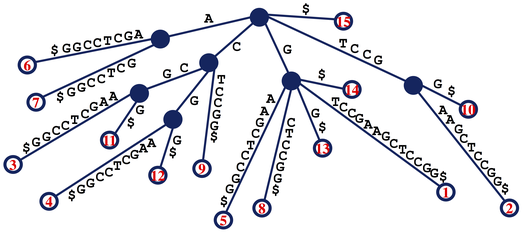

[This](https://rosalind.info/problems/lrep/) problem asks:

> **Given**: A DNA string _s_ (of length at most 20 kbp) with $ appended, a positive integer _k_, and a list of edges defining the suffix tree of _s_.
> Each edge is represented by four components:
> 1. the label of its parent node in _T(s)_
> 2. the label of its child node in _T(s)_
> 3. the location of the substring _t_ of _s*_ assigned to the edge; and
> 4. the length of _t_.

> **Return**: The longest substring of _s_ that occurs at least _k_ times in _s_. 

<!--break-->

# References
1. [Trie](https://rosalind.info/glossary/trie/)
2. [Repeated substring](https://rosalind.info/glossary/repeated-substring/)
3. [_K_-fold substring](https://rosalind.info/glossary/k-fold-substring/)
4. [Suffix tree](https://en.wikipedia.org/wiki/Suffix_tree)

# Restating the problem
I'm going to get a DNA string, _s_, up to 20,000 [base pairs](https://en.wikipedia.org/wiki/Base_pair) long, an integer _k_, and a list of all the nodes in a suffix tree for the DNA string.

I need to return the longest substring of _s_ that appears _k_ times.

There is a **hint** with this challenge:

> How can repeated substrings of _s_ be located in _T(s)_?

# Solution steps
Since this problem statement mentions the "[Introduction to Pattern Matching](https://rosalind.info/problems/trie/)" challenge, I reviewed [my code](https://github.com/rmbryan71/rosalind/blob/0ac8b18bb7df7ec440dd6db81005a469a15575b4/solution-code/trie.py) for that before starting here.

I thought about how I would solve this without the suffix tree. Every solution I could think of started with a catalog of all the substrings of _s_. With an _s_ of 20,000 characters, that's a lot of substrings. I decided to try using the suffix tree.

I looked at the suffix tree graph example shown at the top of this page while considering the hint question. I considered that all the internal edges of the suffix tree might be repeated substrings, and the number of child nodes could be the number of times that substring appears. However, I found counter-examples. For example, "CCG" is a substring of _s_ in the illustration, but does not appear as an internal edge.

I felt a strong inclination to start coding a way to read the downloaded dataset into a tree data structure because I had a clear understanding of how that work would progress. I decided to wait and focus on thinking about ways to solve the problem first.

I thought that maybe every internal path is a substring. That fit all the example substrings in the illustration.

After a few days away from this challenge, I returned with the idea that I might not need to build a tree data structure to solve this. Instead, I could just count how many times the node names occur in the list of edges, pick the longest one that appears more than _k_ times and generate the longest substring from the index.

I wrote this code to count which nodes serve as parent nodes to the most edges:

```python
def count_parent_nodes(edges):
    result = {}
    for node in edges:
        result.update({node[0] : 0})
    for node in edges:
        result[node[0]] += 1
    return result
```

The result for this code, shown below, did not include any links to the solution that I could see.

> {'node1': 4, 'node2': 2, 'node3': 2, 'node7': 2, 'node8': 2, 'node11': 2, 'node14': 2}


# Python concepts

# Bioinformatics concepts

# Post-solution notes
**Challenges solved so far:** 72

**How many people solved this before me:** 638

**Most recent solve before me:** 2 days ago

**Time spent on challenge:** 6 hours

**Most time-consuming facet:** 

**Questions from others:** 

**Solutions from others:**

**Problem explanation:** 

**Accomplishments and badges:** 

**Closing thoughts:** 