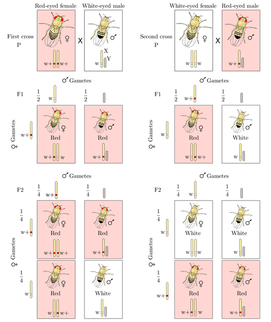
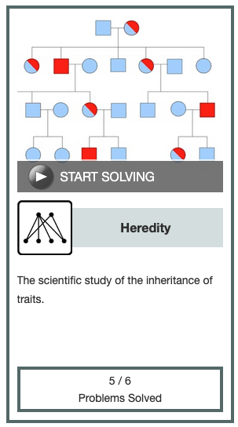

[This](https://rosalind.info/problems/sexl/) problem asks:

> **Given**: An array A of length n for which A[k] represents the proportion of males in a population exhibiting the k-th of n total recessive X-linked genes. Assume that the population is in genetic equilibrium for all n genes.

> **Return**: An array B of length n in which B[k] equals the probability that a randomly selected female will be a carrier for the k-th gene.

<!--break-->

# References
1. [X-linked recessive inheritance](https://en.wikipedia.org/wiki/X-linked_recessive_inheritance)
2. [Sex linkage](https://en.wikipedia.org/wiki/Sex_linkage)
3. [Hardy-Weinberg principle](https://en.wikipedia.org/wiki/Hardy%E2%80%93Weinberg_principle)

# Restating the problem
Given the proportion of males with a recessive sex-linked condition, what proportion of the female population are carriers?

# Solution steps
I started with my code from [Counting Disease Carriers](https://rosalind.info/problems/afrq/) because they both take in an array and return an array of the same length as a result.

[Wikipedia](https://en.wikipedia.org/wiki/Sex_linkage) puts the probabilities this way:

> Sons of a healthy carrier female have a 50% change of being affected, while sons of an affected female will always be affected. Females must inherit a X-linked recessive allele from each parent. All daughters of an affected father and healthy non-carrier mother will be carriers. Daughters of an affected father and carrier mother will have a 50% chance of being affected, and daughters of two affected parents will always be affected.

I coded that as:
```python
2*p * (1-p)
```
That solved the sample dataset correctly.

My first attempt at a challenge dataset was correct. The full code is:
```python
if __name__ == "__main__":
    file_path = "/Users/robertbryan/Downloads/rosalind_sexl.txt"
    proportion_recessives = [float(x) for x in open(file_path).read().strip().split()]
    for p in proportion_recessives:
        print(round(2*p * (1-p), 3), end=' ')
```

# Post-solution notes
**Challenges solved so far:** 73

**How many people solved this before me:** 614

**Most recent solve before me:** 2 days

**Time spent on challenge:** 15 minutes

**Most time-consuming facet:** writing the equation for probabilities

**Accomplishments and badges:** Heredity badge, level 1



**Closing thoughts:** 