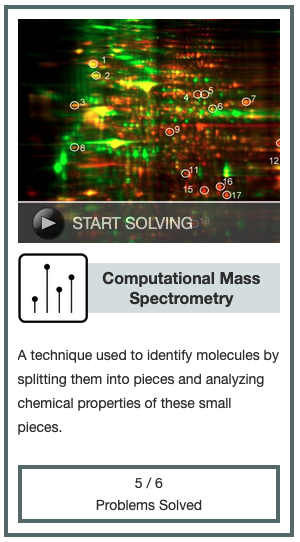

[This](https://rosalind.info/problems/sgra/) problem asks:

> **Given**: A list L (of length at most 100) containing positive real numbers.

> **Return**: The longest protein string that matches the spectrum graph of L

<!--break-->

# References
1. [Spectrum graph](https://rosalind.info/glossary/spectrum-graph/)
2. [Directed graph](https://rosalind.info/glossary/directed-graph/)

# Restating the problem
I'm going to get a list of weights. I need to find the longest protein string that matches the given list of weights.

# Solution steps
This sounded a lot like the earlier challenge, "[Inferring Peptide from Full Spectrum](https://rosalind.info/problems/full/)", so I started with my code from there.

I made two changes.

First, I removed this line because the dataset for this challenge does not include the total weight of the sample.

```python
    parent_mass = L.pop(0)
```

Second, I changed the end condition for this loop from:

```python
    n = (len(ions)-2)/2
```

to

```python
    n = (len(ions))/2
```

That's it. That solved the challenge.

# Post-solution notes
**Challenges solved so far:** 

**How many people solved this before me:** 556

**Most recent solve before me:** 11 days

**Time spent on challenge:** 9 minutes

**Most time-consuming facet:** copying code from previous challenge

**Accomplishments and badges:** Computational Mass Spectrometry level 1



**Closing thoughts:** 