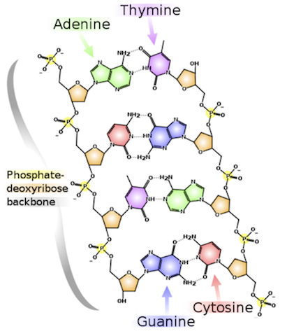

[This](https://rosalind.info/problems/dna/) problem asks:

> **Given**: A DNA string _s_ of length at most 1000 nt.

> **Return**: Four integers (separated by spaces) counting the respective number of times that the symbols 'A', 'C', 'G', and 'T' occur in _s_.

<!--break-->

# Restate the problem
(Restating the problem is a good place to start. [Why?](https://idea-sandbox.com/blog/11-ways-to-restate-problems-to-get-better-solutions/))
They're going to send me a DNA string no longer than 1000 characters. I need to count the A's, C's, G's, and T's, then return those results.
# How Project Rosalind works
The way [Project Rosalind](https://rosalind.info/about/) works is that I click a big "**Download Dataset**" button and the website deposits a file in your downloads folder.
This problem's abbreviation is "dna", so the download file will be called "rosalind_dna.txt"

Then you have 5 minutes to run your code and upload your answer. 

Since time is limited, and we don't want to waste time looking for files or moving information around with copy and paste, we'll start our program by opening the specific file in the downloads folder.
For me, that's:
```
file_path = "/Users/robertbryan/Downloads/rosalind_dna.txt"
```

When I run my code, I save the results in a file like so:
```python
solution_path = "../solution-outputs/rosalind_dna.txt"
```

Then, I can upload my solution file to Project Rosalind, hit **submit** and see if my response is correct.
# Solution steps
Python includes a [list count method](https://www.w3schools.com/python/ref_list_count.asp) that solves this problem in one step.

I used python's list count method to count all the A's, C's, G's, and T's as shown below.

```python
return (
    sequence.count("A"),
    sequence.count("C"),
    sequence.count("G"),
    sequence.count("T")
)
```

Then I wrote my results to a text file: problem solved.
# Python concepts
## Efficiency
My solution ran on the test set in less than a second, but it's not the fastest solution because it has to go all the way through the test set four times.
Once to count the A's, once to count the C's, etc...

Since the problem tells us the maximum number of letters in the test set is 1000, and we have 5 minutes to solve the problem, my inefficient solution that takes less than a second is fine.

If I wanted to solve this problem for datasets that are many orders of magnitude larger, I would set up four counters: A, C, G, and T. Then I would run through the list one time and increment the counter that matches the letter in the test set.

## File handling
Python comes with [easy-to-use tools](https://www.w3schools.com/python/python_file_handling.asp) for opening, reading, appending, writing, and closing files.
Using the file handling functions was straightforward. I followed the examples in the documentation and they worked as expected.

## Idempotency
[Wikipedia article on Idempotence](https://en.wikipedia.org/wiki/Idempotence#Computer_science_examples)

Idempotent had many different meanings. The one that applies here is that once an idempotent process has been executed once, executing it again has no effect.

One day-to-day example of an idempotent function is an elevator call button. Pressing it the first time calls the elevator.
Pressing it any number of times after that has no no effect.

It's useful for computer program to be idempotent because it means the operation can be tried as often as necessary without [unintended effects](https://en.wikipedia.org/wiki/Unintended_consequences).

To make my program idempotent, I check to see if there's already a solution file in place before I try to write a new solution file.
```python
if os.path.exists(solution_path):
    os.remove(solution_path)
```

If I **don't** check, and there's already a solution file there, I'll get an error:
```python
Traceback (most recent call last):
  File "/Users/robertbryan/PycharmProjects/rosalind/solution-code/dna.py", line 29, in <module>
    file = open(solution_path, "x")
FileExistsError: [Errno 17] File exists: '../solution-outputs/rosalind_dna.txt'
```

There are [several ways](https://stackoverflow.com/questions/11469228/how-to-replace-overwrite-file-contents-instead-of-appending) to avoid this error.

# Bioinformatics concepts
## DNA Structure

_image from Project Rosalind_

While counting the different letters in a string of text is relatively simple, DNA structure that those letters represent
is fascinating and complex. This problem introduces the concept of the [DNA code](https://www.britannica.com/science/DNA) with carries
genetic information for the transmission of inherited traits. 

## Rosalind Franklin


Project Rosalind is named after Rosalind Franklin who, despite only living to the age of 37, lived an [absolutely fascinating life](https://en.wikipedia.org/wiki/Rosalind_Franklin), 
and was instrumental in our understanding of the molecular structures of DNA.