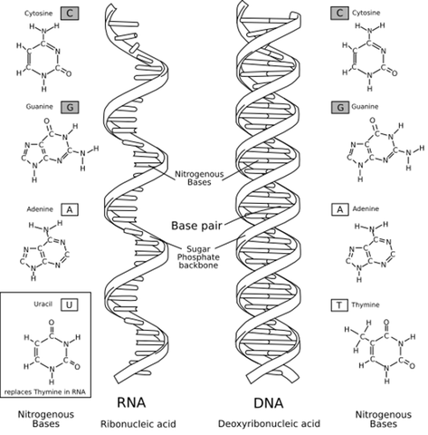

[This](https://rosalind.info/problems/rna/) problem asks:
> **Given**: A DNA string t having length at most 1000 nt.

> **Return**: The transcribed RNA string of t
<!--break-->

# Restate the problem
They're going to send me a relatively small file, and all I have to do is replace each "T" with a "U".

# Solution steps
Python has a built-in function called [replace()](https://www.w3schools.com/python/ref_string_replace.asp) that does exactly what this problem calls for.

Alternatively, I could do this in any word processor by finding every instance of "T" and replacing with "U".
# Python concepts
Finding a built-in function that does _exactly_ what the problem calls for can be a special thrill. 
Often, this process begins with a [Google](https://www.google.com/) search. In this case:
> Python string replace

When choosing between multiple websites that document Python features, I prefer [w3schools](https://www.w3schools.com/python/default.asp) and [python.org](https://www.python.org/) because in my experience they are the easiest to use and most comprehensive.

Hundreds of [other options](https://github.com/openlists/PythonResources) exist.

# Bioinformatics concepts

_image from Project Rosalind_

[RNA](https://en.wikipedia.org/wiki/RNA) is usually single-stranded, but there are many different kinds of RNA and not all of 
them are well understood. The first approved vaccines for [COVID-19](https://en.wikipedia.org/wiki/COVID-19_pandemic) were [mRNA vaccines](https://en.wikipedia.org/wiki/MRNA_vaccine#mRNA).

