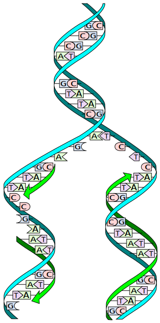

[This](https://rosalind.info/problems/revc/) problem asks:

> **Given**: A DNA string s of length at most 1000 bp.

> **Return**: The reverse complement s'c of s.

<!--break-->

# Restate the problem
They're going to send me a string of text not longer than 1000 characters. I need to return that string in reverse
order with every 'A' changed to a 'T', every 'T' changed to an 'A', every 'C' changed to a G, and every 'G' changed to a 'C'.

# Solution steps
I am not a computer programmer. I'm not trying to become a computer programmer. I enjoy problem solving, technical writing, and
bioinformatics. As such, when it's possible, I'm going to leave the programming to professionals and focus on my interests.

This can be a controversial choice since most of the people who work on Project Rosalind are programmers, so they chose to
write their solutions from scratch. 

Instead, I'm going to be using [code libraries](https://en.wikipedia.org/wiki/List_of_open-source_code_libraries).
Code libraries are collections of pre-written code that people use to perform specific tasks more efficiently without having to write their own code from scratch.

Biopython is a massive code library of tools for a wide variety of computational molecular biology tasks. It also happens to be
[expertly documented](https://biopython.org/docs/latest/).

I'm going to take full advantage of these tools because they're far more advanced and capable than anything I'm interested in building myself.

Biopython has a function that returns the reverse complement of a DNA strand, so I'm going to use that.

# Python concepts
I found the [right tool for the job in Biopython](https://biopython.org/docs/1.75/api/Bio.Seq.html#Bio.Seq.Seq.reverse_complement).

Once that's done, including a code library is simple in Python. In my case, I only need:

```python
from Bio.Seq import Seq
```

You can see all of my code [here](https://github.com/rmbryan71/rosalind/blob/main/solution-code/revc.py), but the most interesting line is:

```python
file.write(str(seq.reverse_complement()))
```
I've defined a Sequence, and I'm writing it's complement to a file.
# Bioinformatics concepts
[Complementarity](https://en.wikipedia.org/wiki/Complementarity_(molecular_biology)) describes the relationship between the two sequences of nucleobases on opposite strands of the double-helix.

The relationship is key to the processes of [transcription](https://en.wikipedia.org/wiki/Transcription_(biology)) and [replication](https://en.wikipedia.org/wiki/DNA_replication), both of which rely on the properties of complementarity.

A view of the replication process is shown below.



By I, Madprime, CC BY-SA 3.0, https://commons.wikimedia.org/w/index.php?curid=2497221