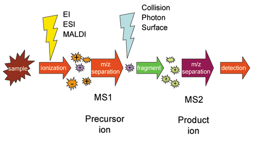

image of [tandem mass spectrometry](https://en.wikipedia.org/wiki/Tandem_mass_spectrometry) from Wikipedia

[This](https://rosalind.info/problems/prtm/) problem asks:

> **Given**: A protein string P of length at most 1000 aa.

> **Return**: The total weight of P.

<!--break-->

# Required reading
1. [Weighted alphabet](https://rosalind.info/glossary/weighted-alphabet/)
2. [Peptide bond](https://en.wikipedia.org/wiki/Peptide_bond)
3. [Monoisotopic mass table](https://rosalind.info/glossary/monoisotopic-mass-table/)
4. [Proteomics](https://en.wikipedia.org/wiki/Proteomics)
5. [Tandem mass spectrometry](https://en.wikipedia.org/wiki/Tandem_mass_spectrometry)

# Restate the problem
There is a [monoisotopic mass table](https://rosalind.info/glossary/monoisotopic-mass-table/) provided with the challenge.
For each protein in the string of proteins they provide, I need to look up the weight in the table and add all the weights together.

# Solution steps
I decided to use Biopython instead of writing my own table look-up code, so the first step was to find the right Biopython method to use.

The [Bio.SeqUtils.ProtParam](https://biopython.org/docs/1.75/api/Bio.SeqUtils.ProtParam.html) module includes a molecular_weight method which is an exact fit for this challenge.

When I set the isotope mode to True and subtracted 18.01056 [da](https://rosalind.info/glossary/dalton/) from the final result to account for the single water molecule mentioned in the challenge, I got the correct weight for the sample dataset.

# Python concepts
My solution code for this challenge is [here](https://github.com/rmbryan71/rosalind/blob/main/solution-code/prtm.py).

There were no new Python concepts used in this solution.

Writing the look-up code in Python would have used a [dictionary](https://docs.python.org/3.13/tutorial/datastructures.html#dictionaries) to hold the molecular mass table, then an algorithm like this to look up the masses and add them together:
```python
mass = 0
for char in protein:
    mass += amino_mass[char]
```

# Bioinformatics concepts
Although adding these protein masses together, discovering the weights of the different proteins took a lot of [work](https://en.wikipedia.org/wiki/Proteomics).

