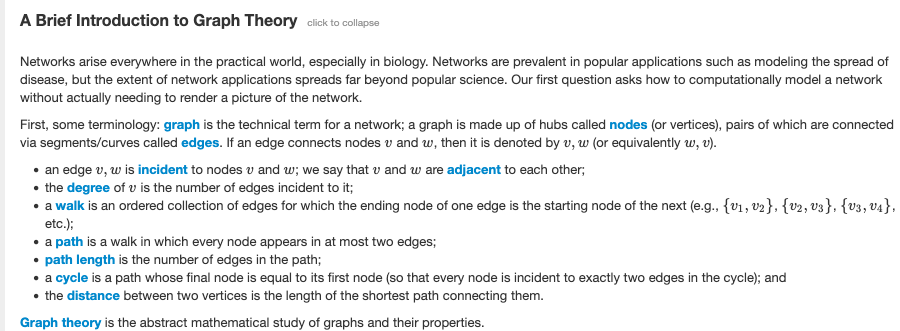

_By Michel Bakni - Own work, CC BY-SA 4.0, https://commons.wikimedia.org/w/index.php?curid=151762031_

[This](https://rosalind.info/problems/grph/) problem asks:

> **Given**: A collection of DNA strings in FASTA format having total length at most 10 kbp.

> **Return**: The adjacency list corresponding to O3. You may return edges in any order.

<!--Break-->

# Required reading
The following topics were required to restate the problem:
1. [Adjacency list](https://en.wikipedia.org/wiki/Adjacency_list)
2. [Directed graph](https://en.wikipedia.org/wiki/Directed_graph)
3. [Overlap graph](https://rosalind.info/glossary/overlap-graph/)

# Restate the problem
The little paragraphs that Project Rosalind uses for introductions and problem statements are some of the densest bits of text I've ever seen. Consider the following "Brief Introduction to Graph Theory":

[Graph theory](https://en.wikipedia.org/wiki/Graph_theory) is a massive topic. How well do I need to understand graph theory to solve this problem? They don't say, but I'm not able to restate the problem in my own words without spending considerable time looking up words and reading wikipedia pages. 

They're going to send me a set of DNA strings in [FASTA format](https://en.wikipedia.org/wiki/FASTA_format). I need to return, in any order, every instance where the first three values in one string are the last three values in the second string.

# Solution steps
On a **personal note**, I need to mention that this is the first challenge where I feel like I'm starting from scratch. In the previous challenges, I remembered some or all of the processes I went through to solve these back in 2018. 

Not so with this one. 

Project Rosalind says I solved this on March 6, 2018 at 8:18 a.m., but I have absolutely no memory of this.

I started writing [nested for loops](https://www.w3schools.com/python/gloss_python_for_nested.asp), but could not get them to work correctly, despite a lot of [print-statement debugging](https://dev.to/fahimulhaq/a-gentle-introduction-to-print-statement-debugging-393j).

In the end, the problem wasn't with my for loops at all. I had not written my read_fasta method to correctly return a list.

Finally, when I had my code working and returning the correct result for the sample dataset in the console, I got a **"Wrong answer"** response from Project Rosalind. It took some time for me to figure out that I had put line breaks in the console print statements, but not in the solution file write statements.

# Python concepts
I was forced to review the difference between [iterators, generator functions](https://pythongeeks.org/python-generators-vs-iterators/), and lists in Python because SeqIO.parse() returns a generator function, not a list.

Print statements for debugging also played a role in solving this challenge, along with [string slicing](https://www.w3schools.com/python/python_strings_slicing.asp). 

# Bioinformatics concepts
I read more about the [fasta format](https://blast.ncbi.nlm.nih.gov/doc/blast-topics/#query-input-and-database-selection) because I didn't understand how complicated that specification was.

[Graph theory](https://en.wikipedia.org/wiki/Graph_theory) came into play for the first time in this challenge. Although this was a relatively simple example, I predict that future Project Rosalind challenges will make extensive use of graph theory, so spending time reading about the basics seemed like time well invested. 

# Problem-solving topics
This was one of the first challenges where I had quick ideas with long implementation times. That is, I had a clear idea about how to go about solving this challenge quickly, but it took me a long time to write the code that put that idea into practice, mainly because I had [unrecognized assumptions](https://criticalthinkingsecrets.com/identify-assumptions-2/).

