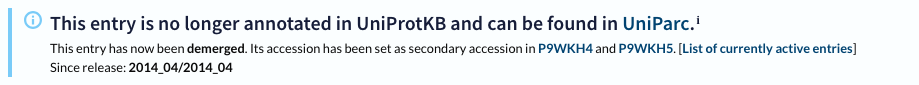

_Error message seen in the course of solving this challenge._

[This](https://rosalind.info/problems/mprt/) problem asks:

> **Given**: At most 15 UniProt Protein Database access IDs.

> **Return**: For each protein possessing the N-glycosylation motif, output its given access ID followed by a list of locations in the protein string where the motif can be found.

<!--Break-->

# Required reading
This is the reading I did so that I could restate the problem:
1. [Protein domain](https://en.wikipedia.org/wiki/Protein_domain) (x2)
2. [Protein families](https://en.wikipedia.org/wiki/Protein_family)
3. [Chimeric protein](https://en.wikipedia.org/wiki/Fusion_protein)
4. [Chimeric genes](https://en.wikipedia.org/wiki/Chimeric_gene)
5. [UniProt](https://www.uniprot.org/)
6. [UniProt accession numbers](https://www.uniprot.org/help/accession_numbers)
7. [N-linked glycosylation](https://en.wikipedia.org/wiki/N-linked_glycosylation)

# Restate the problem
I'm going to get a list of protein IDs. First, I need to download the records for these proteins from UniProt. Then I need to go through the protein sequences and find every place where there is a match for "N{P}[ST]{P}" where {P} means "not P" and [ST] means "either S or T".

# Solution steps
My first task was to take the protein IDs in the sample dataset and download their sequences from Uniprot. Sadly, two of the example protein IDs in the sample dataset returned [404 errors](https://en.wikipedia.org/wiki/HTTP_404) at UniProt.

After some investigation, I found that UniProt changed their naming conventions after the Project Rosalind challenge was written. Converting the Project Rosalind id's to ones that worked with UniProt was a matter of removing the underscores and suffixes.

Writing the [regex](https://en.wikipedia.org/wiki/Regular_expression) to identify the motif took me a while. The result was:
```python
sites = [g.start()+1 for g in finditer(r'(?=N[^P][ST][^P])', seq)]
```

# Bioinformatics concepts
[Glycosylation](https://wellwisp.com/what-is-n%E2%80%91glycosylation/) = 'N-glycosylation is a biochemical process where a carbohydrate, known as an oligosaccharide or glycan, is attached to a nitrogen atom in a protein, specifically at the asparagine residue. This modification is crucial for the structure and function of many proteins in eukaryotic cells.'

# Problem-solving concepts
This was the first challenge where I felt like the difficulty came from "[out of scope](https://www.tacticalprojectmanager.com/in-scope-vs-out-of-scope/)", meaning the intricacies of solving the challenge didn't come from bioinformatics, algorithm design, or even the logistics of coding, but from getting data from a database that evolved after the challenge was written.

Since Project Rosalind is old, the challenges were posted in 2012, there are likely to be more cases like this in the future, so it's worth remembering that thing are not the way they were.

Even after I solved all the problems getting the data from UniProt and finding the correct locations for all the protein binding locations, I still submitted an incorrect response the first time. My mistake was that wrote a comma-delimited list of sites instead of space delimited one.

, Project Rosalind provides me with a sample dataset and a sample output. That's a useful guide during problem-solving. If I can write a solution that is correct for the sample dataset, it's likely that it will be correct for the challenge dataset that I download when solving the problem.

# Conclusion
I did not take me very long to _conceptually_ solve this challenge.

It took me a **very long time** to submit a correct answer.

I've considered keeping track of how long it takes me to solve these challenges, but there's enough going on in my mind while I work these already. The last thing I need is time pressure, so I'm avoiding that for now.

