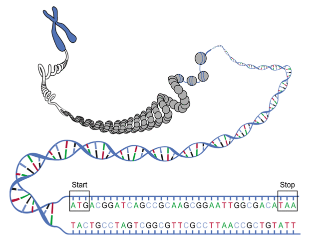

image from [Project Rosalind](https://rosalind.info/media/problems/orf/orf.gif).

[This](https://rosalind.info/problems/orf/) problem asks:

> **Given**: A DNA string s of length at most 1 kbp in FASTA format.

> **Return**: Every distinct candidate protein string that can be translated from ORFs of s.

<!--break-->

# Required reading:
1. [Open reading frames](https://en.wikipedia.org/wiki/Open_reading_frame)
2. [Clarifying definition of ORFs](https://www.cell.com/trends/genetics/fulltext/S0168-9525(17)30229-9?_returnURL=https%3A%2F%2Flinkinghub.elsevier.com%2Fretrieve%2Fpii%2FS0168952517302299%3Fshowall%3Dtrue)
3. [Exon and coding region](https://en.wikipedia.org/wiki/Coding_region)
4. [DNA codon table](https://en.wikipedia.org/wiki/Genetic_code#DNA_codon_table) re-read

# Restate the problem
I'm going to get a single DNA string. I need to identify the regions between [start codons](https://en.wikipedia.org/wiki/Start_codon) and [stop codons](https://en.wikipedia.org/wiki/Stop_codon) going either direction on the string. Then, I need to decode those regions into proteins using the [DNA codon table](https://rosalind.info/glossary/dna-codon-table/).

# Solution steps
I found [this section of the Biopython cookbook](https://biopython.org/docs/latest/Tutorial/chapter_cookbook.html#identifying-open-reading-frames) that shows an ORF finder built with Python, but I confess I don't understand how that works. I made a note to come back and try to figure this out if nothing else works.

I also found the [PyPi project ORFFinder](https://pypi.org/project/orffinder/) that includes methods for identifying ORFs in DNA strings.

The orffinder method gets ORFProteins() returns a partial solution, but does not include all the possible proteins that can be decoded from the DNA sequences in the ORF. I read the [source code for orffinder](https://github.com/Chokyotager/ORFFinder/blob/main/src/orffinder/orffinder.py), but didn't see a way to customize it to include all possible proteins.

I tried to use ORFFinder to get the Open Reading Frames, then pass the DNA sequences in those frames to Biopython, but could not get the sample dataset to decode to the sample output, so after a while of struggling, I gave up on ORFFinder and start from scratch.

I knew I was going to need the DNA sequence as well as it's reverse complement, so I started by reading the DNA sequence into a string and letting Biopython assign the reverse complement to a string.

Next, I needed to go through both strings and look for the start codon, 'ATG'. I stepped all the way through both sequences, and whenever I found 'ATG', I added the whole DNA string from that point to the end to my list of DNA strings.

> But what about Open Reading Frames? Don't you need to find the stop codons?

As it turns out, no. I don't need to find the stop codons because Biopython.Seq.translate does that and puts an asterisk in the output whenever it comes across a stop codon.

So, finally, I got each dna fragment translated into proteins via Biopython, then, whenever I found an asterisk, I just snipped the protein at that point, got rid of the asterisk and added the protein string to the list of protein strings.

I got rid of duplicates by converting the list into a set, then back into a list. It would have been simpler to use a set from the beginning.

# Python concepts
I moved to some more [Pythonic](https://realpython.com/ref/glossary/pythonic/) methods this time.

First, I used:
```python
sequence = ''.join(x.strip() for x in open(file_path, 'r').readlines()[1:])
```
to read the DNA sequence out of the file.

Then at the end, I used:
```python
print('\n'.join(y for y in list(set(proteinlist))))
```
to display the results in the console.

I also gave up on writing the output to a file for this challenge because it was just as fast to copy the answer strings out of the console and paste them into Project Rosalind.

# Bioinformatics concepts
I learned about the simplest fundamentals of the [DNA transcription process](https://en.wikipedia.org/wiki/Transcription_(biology)), picking up just enough to solve this problem, while appreciating that there is a whole field of study around this.

# Problem-solving concepts
I side-stepped the focus of this challenge by letting my DNA list-building routine find the start codons while getting the stop codons from the Biopython translate method. I never did generate a list of Open Reading Frames. I wonder if that's a technique that could be used in the future?

