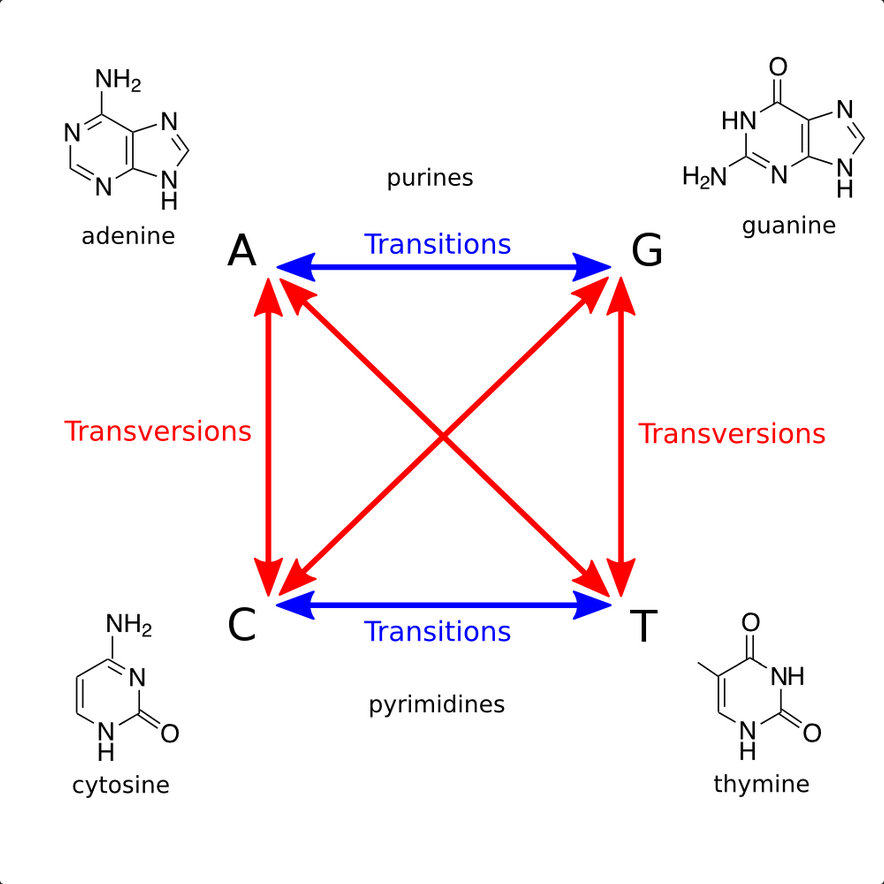

[image from Project Rosalind](https://rosalind.info/media/problems/tran/transitions-transversions.png).

[This](https://rosalind.info/problems/tran/) problem asks:

> **Given**: Two DNA strings s1 and s2 of equal length (at most 1 kbp).

> **Return**: The transition/transversion ratio R(s1,s2).

<!--break-->

# Required reading
1. [Point mutations](https://en.wikipedia.org/wiki/Point_mutation)
2. [Transitions](https://en.wikipedia.org/wiki/Transition_(genetics))
3. [Transversions](https://en.wikipedia.org/wiki/Transversion)
4. [Transition/transversion ratio](https://rosalind.info/glossary/transitiontransversion-ratio/)

# Restate the problem
I need to find everywhere that s1 and s2 are different. For each difference, I need to figure out if it's a transition or a transversion. I need to return the ratio of transitions to transversions.

# Solution steps
First, I set up two counters: _transitions_ and _transversions_, and started them both at zero.

Then, I compared s1 and s2 character by character.

Every time there was a difference between the two DNA strings, I checked to see if the difference was a transition or a transversion and added 1 to the appropriate counter.

At the end, I printed the ratio of transitions to transversions in the console.

