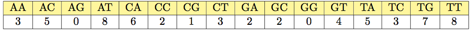

[A 2-mer composition from Project Rosalind](https://rosalind.info/problems/kmer/)

[This](https://rosalind.info/problems/kmer/) problem asks:

> **Given**: A DNA string s.

> **Return**: The 4-mer composition of s.

<!--break-->

# Required reading
1. [k-mers](https://en.wikipedia.org/wiki/K-mer)
2. [n-gram](https://en.wikipedia.org/wiki/N-gram)
3. [k-mer composition](https://rosalind.info/glossary/k-mer-composition/)
4. [Python dictionaries](https://www.w3schools.com/python/python_dictionaries.asp)

# Restate the problem
For this problem, it's important to understand a k-mer is a substring of DNA with length k. I'm going to get a DNA string, _s_, up to 100,000 base-pairs long. In terms of the data I've handled before in Project Rosalind, _s_ is a **very** large string, so I'll need to keep that in mind while I'm coding.

I need to generate a 4-mer composition array, which is a count of all the DNA substrings in _s_ that are 4 base-pairs long. There are 256 possible 4-mers in DNA. In alphabetical (or lexicographical, as it's described in this challenge) order, the list of 256 possible combinations starts with:

> AAAA, AAAC, AAAG, AAAT, AACA, AACC, AACG, AACT, ...

So my response needs to begin with the number of times "AAAA" appears in _s_, then the number of times "AAAC" appears, and so forth, through to the 256th number which is the count of how many times "TTTT" appears in _s_.

# Solution steps
First, I made a function to populate a [Python dictionary](https://www.w3schools.com/python/python_dictionaries.asp) with the 256 possible 4-mers of DNA as keys and zeros for all the values.

I used the itertools product function for this. My code:
```python
def build_dictionary():
    dict = {}
    for item in product('ACGT', repeat=4):
        dict[item] = 0
    return dict
```

Then I wrote a function to take a string of DNA and an empty dictionary, then return a populated dictionary where all the values are equal to the counts of the corresponding k-mers, in this case, 4-mers. The code:
```python
def populate(sequence, dictionary):
    for i in range(len(sequence) - 3):
        kmer = sequence[i:i+4]
        lookup = (str(kmer[0]), str(kmer[1]), str(kmer[2]), str(kmer[3]))
        # print(kmer)
        dictionary[lookup] += 1
    return dictionary
```

A few notes from this function:
1. I need to stop iterating through the input string at (len(sequence) - 3) so that the last character is considered only one time and my function stops after properly considering that last character.
2. I build _lookup_ in a comma-separated list of strings because that matches how I built my dictionary.
3. This for-loop is going to run almost as many times as the DNA string _s_ is long, so if my code is slow, this is where I need to focus my efficiency efforts.

Finally, I wrote code to read the values out of the results dictionary and write them to a file. That code is:

```python
file = open(solution_path, "x")
file.write(str((list(dict2.values()))).replace('[','').replace(']','').replace(',', ''))
file.close()
```

Chaining replace commands together like that can be inefficient, but my code only writes to the results file one time, so I accept this inefficient method.

With these 3 functions in place, I got a successful result on the Project Rosalind sample dataset.

My first attempt at a real dataset ran quickly and returned a correct result. 3,539 people solved this before me.
When I look at the solutions that other solvers have posted, nearly everyone used the same general approach. The DNA string I got in the real dataset was 94,638 characters long.

# Personal Milestone
This is the first challenge in Project Rosalind that I solved for the first time in 2025. With the completion of the previous challenge, "[Genome Assembly as Shortest Superstring](https://www.robertbryan.net/posts/2025-08-31-long.html)" I have reworked the challenges I had done previously in 2018. So from now on, these will all be new to me. Frankly, this doesn't feel like much of a change, since I have forgotten everything from 2018 anyway.

# Appendix: my actual result
> 378 405 362 385 366 372 375 420 355 343 404 356 352 386 423 380 371 383 378 349 369 366 353 372 331 367 365 350 427 360 410 376 357 385 325 391 367 348 354 394 337 371 383 370 356 363 332 386 395 377 339 365 353 389 373 360 338 384 394 388 352 366 367 343 378 383 359 393 359 363 339 374 382 410 357 355 369 379 320 334 358 352 359 338 358 384 382 366 333 333 366 408 369 396 350 379 366 340 352 360 341 357 376 363 346 368 372 385 398 379 384 367 404 384 356 365 395 369 371 383 386 344 354 420 385 365 403 361 383 369 373 347 373 348 365 369 357 359 332 350 394 328 384 359 383 340 381 348 344 336 342 370 367 367 378 406 362 377 399 356 384 356 350 351 394 348 378 387 351 410 358 380 376 359 372 381 387 379 376 378 373 368 385 354 373 372 379 362 360 393 346 393 391 376 364 416 383 377 334 410 364 351 368 376 361 382 377 355 401 360 386 367 336 404 363 386 387 370 362 364 351 385 345 403 365 374 371 363 350 339 410 350 407 358 386 353 390 378 398 358 361 364 388 367 393 363 354 388 376 349 377 354 383 374 340 365
