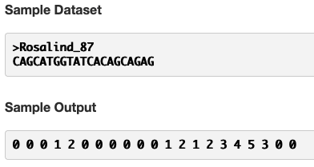
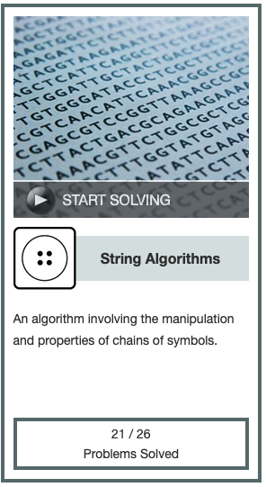

[This](https://rosalind.info/problems/kmp/) problem asks:

> **Given**: A DNA string s.

> **Return**: The failure array of s.

<!--break-->

# Required reading
1. [Failure array](https://rosalind.info/glossary/failure-array/)
2. [Knuth–Morris–Pratt algorithm](https://en.wikipedia.org/wiki/Knuth%E2%80%93Morris%E2%80%93Pratt_algorithm)

# Restate the problem
The Knuth-Morris-Pratt algorithm is an advancement in the efficiency of finding a substring within a given string. The central improvement over considering each individual character in the string as a possible beginning of the substring is that the Knuth-Morris-Pratt algorithm keeps track of partial successful matches. If a section of the string matches the substring, but then fails to match midway through, the Knuth-Morris-Pratt algorithm doesn't start over with the next character in the string. Instead, it skips ahead to the first character that could possibly be a start of the substring.

For this challenge, I'm going to get a DNA string, _s_. I need to return a [failure array](https://rosalind.info/glossary/failure-array/) of integers the same size as _s_. Every number in the failure array is the count of characters at that point in the string _s_ that match the beginning of the string _s_.

The sample dataset and sample output are helpful in understanding what's being asked here.



The first value in a failure array is always 0. We're given that value in the problem statement. The second value is a 0 because A, the second character, does not match C, the first character.

The third value is 0 because G, the third character, does not match C, the first character.

The fourth value is 1 because C, the fourth character, matches C, the first character.

The fifth value is 2 because A, the fifth character, matches A, the second character.

The sixth value is 0 because T, the sixth character, does not match G, the third character.

... and so on.

# Solution steps
First, I read in the DNA string and create a **result** array that's the same length as the DNA string with a 0 in every position.

Then I start with the second value in the string and increment that value by 1 if it matches the start of the string.

Then I continue iterating through the string and incrementing the positions in the failure array every time there is a match between the current character and the next character from the beginning of the string.

At the end, I throw out the first value in the array and add a 0 at the end. Why?

Well, that's a **bug**. 

I threw out the first value and added a 0 at the end when I was working on this a few weeks ago because that's what I needed to do to make my code return the correct result for the sample dataset. When I ran it on the real dataset and got a correct response, I stopped working on this and moved on. Now that I'm looking at it more closely to write this article, I see a lot about my solution that I don't like. In fact, I think I was lucky to get a dataset that ended with a failure array of 0, because otherwise, my code won't work.

Am I going to dig into code that returned a correct result and make sweeping changes just because I want to make sure I have reliable code to a challenge that I've already solved?

> Yes. Yes, I am.

For reference, the sketchy code that returned a correct result is [here](https://github.com/rmbryan71/rosalind/commit/d6d9b5feed55e4717bce5891b48ca7f0c879b45a).

I'll keep track of my actions here:
I saved a copy of the correct response to my first downloaded dataset so that I can check to see if my altered code still returns a correct result.

I simplified reading the downloaded DNA string from this:

```python
sequence_collection = []
for seq_record in SeqIO.parse(file_path, "fasta"):
    sequence_collection.append(seq_record.seq)
sequence = sequence_collection.pop(0)
```

to this...

```python
for record in SeqIO.parse(file_path, "fasta"):
    sequence = record.seq
```

I got rid of this line without replacement because throwing away the first value in the result might make sense, but there's no reason to add a zero onto the end.
```python
solution = str((result[1:], 0))
```

Instead of starting with position = 2 and using a while statement, I changed to starting with position -1 and using a for-while statement. This required a complete rewrite. The old code:

```python
    result = [0]*len(sequence)
    position = 2
    condition = 0
    while position < len(sequence):
        if sequence[position-1]==sequence[condition]:
            condition+=1
            result[position] = condition
            position+=1
        elif condition>0:
            condition=result[condition]
        else:
            result[position]=0
            position+=1
```

changed to the new code:

```python
    result = [-1]
    counter = -1
    for i in range(len(sequence)):
        while counter >= 0 and sequence[i] != sequence[counter]:
            counter = result[counter]
        counter += 1
        result.append(counter)
    print(*result[1:])
```

I replaced this line:
```python
print(str(result).replace('(', '').replace("[",'').replace(',','').replace(']','').replace(')',''))
```

with this:

```python
print(*result[1:])
```

I needed to get rid of the first value in the result list because it was the -1 that I put there before processing as a placeholder for the counter.

I verified that the new code returned correct responses for both the sample dataset and the real dataset from my original solution. Then, just to be extra-sure I had everything right, I downloaded another real problem dataset from Project Rosalind and submitted my correct result from the new code.

# Post-solution notes
**Challenges solved so far:** 45

**How many people solved this before me:** 2,833

**Most recent solve before me:** 3.5 hours

**Time spent on challenge:** 2 hours, mostly on overhauling the code while writing the article

**Most time-consuming facet:** rewriting the code after solving

**Accomplishments and badges:** String algorithms badge level 3, shown below

**Closing thoughts:** I'm glad I rewrote my code even though it worked. I feel much better about this because I understand how it works.


