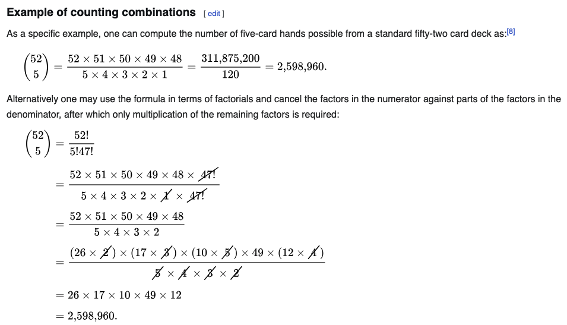

[This](https://rosalind.info/problems/pper/) problem asks:

> **Given**: Positive integers n and k such that 100≥n>0 and 10≥k>0.

> **Return**: The total number of partial permutations P(n,k), modulo 1,000,000.

<!--break-->

# Restate the problem
Reading:
1. [Partial permutations](https://rosalind.info/glossary/partial-permutation/)
2. [More partial permutations](https://en.wikipedia.org/wiki/Partial_permutation) x2
3. [Combinations](https://en.wikipedia.org/wiki/Combination)

I'm going to get two numbers n and k. N is the size of a population. k is the number of items I choose out of that population per iteration. I need to count the number of different ways I can choose k items out of a population n.

# Solution steps
In reading the Wikipedia article on combinations, I saw the formula shown below to calculate the number of 5-card poker hands possible from a standard 52-card deck.



I wrote two different implementations of "n choose k" algorithms in Python, but neither gave the correct answer for the sample dataset.

I installed the [scipy library](https://scipy.org/), used the [perm method](https://docs.scipy.org/doc/scipy/reference/generated/scipy.special.perm.html), and got the correct answer instantly.

I downloaded a Project Rosalind dataset and got a correct response on my first attempt, then moved on to other challenges. However, now that I'm writing this article, I want to figure out how to implement the "n choose k" algorithm myself.

I've borrowed a recursive factorial function that I wrote from another challenge, and I figured out that my function to count the number of combinations of _n_ items from a set of size _k_ was just missing a set of parentheses, so that works now, it return the correct result for the example given on wikipedia, but it returns a different result than Scipy perm.

Using [Wolfram Alpha](https://www.wolframalpha.com/input?i=81+perm+10), I learned about the [difference between counting combinations vs counting permutations](https://www.mathsisfun.com/combinatorics/combinations-permutations.html).

I fixed my own code so that returned the same results as Scipy perm. Then I removed all the Scipy code from my solution and downloaded another dataset from Project Rosalind.
My full set of code for this challenge after removing the Scipy library:

```python
def fact(n):
    if n < 2:
        return 1
    else:
        return n * fact(n - 1)

def comb(n, k):
    return fact(n) // (fact(n - k))

if __name__ == "__main__":
    file_path = "/Users/robertbryan/Downloads/rosalind_pper.txt"
    file = open(file_path, "r").read().split(' ')
    n, k = int(file[0]), int(file[1])
    print(comb(n, k) % 1000000)
```

This returned a correct result for the new dataset.

# Post-solution notes
**Challenges solved so far:** 45 (I solved this challenge for the first time in 2018.)

**Time spent on challenge:** 90 minutes, mostly on the rewrite I did to replace the library code with my own code.

**Most time-consuming facet:** Getting clear on the difference between counting combinations and permutations.

**Closing thoughts:** I'm glad I coded this myself instead of accepting the library result and moving on. I got clearer about the distinction between combinations and permutatations, which is helpful.


