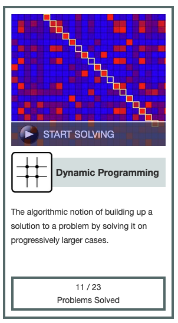

[Dynamic programming badge from Project Rosalind.](https://rosalind.info/badges/dynamic-programming/1/)

[This](https://rosalind.info/problems/lcsq/) problem asks:

> **Given**: Two DNA strings _s_ and _t_

> **Return**: A longest common subsequence of _s_ and _t_.

<!--break-->

# Required reading
1. [Common subsequence](https://rosalind.info/glossary/common-subsequence/)
2. [Longest common subsequence](https://en.wikipedia.org/wiki/Longest_common_subsequence)
3. [Two-dimensional arrays in Python](https://www.geeksforgeeks.org/python/python-using-2d-arrays-lists-the-right-way/)
4. [Python max function examples](https://www.w3schools.com/python/ref_func_max.asp)
5. [Python range(len())](https://pythonexamples.org/python-range-len/)
6. [Python iterables](https://stackoverflow.com/questions/19184335/is-there-a-need-for-rangelena)
7. [Python debugging](https://www.jetbrains.com/help/pycharm/part-1-debugging-python-code.html)
8. [Stack Overflow on Longest Common Subsequence](https://stackoverflow.com/questions/48651891/longest-common-subsequence-in-python)

# Restate the problem
I'm going to get two strings. I need to return the longest substring that appears in both. The characters in the substring do not need to appear consecutively in the super-stings. This is different from the longest common substring problem because the subsequences do not occupy consecutive positions in the original sequences.

# Solution steps
The Wikipedia page included [pseudocode](https://en.wikipedia.org/wiki/Pseudocode) for a two-step solution that starts by building a two-dimensional array to store the lengths of the longest common subsequences of all the subsequences of _s_ and _t_.

Then, a backtrack function uses the two-dimensional array to read out the longest common subsequence.

I wrote the two functions in Python.

After some [off-by-one](https://en.wikipedia.org/wiki/Off-by-one_error) errors, I got a pair of functions that worked correctly for the sample dataset.
When I downloaded a real dataset from Project Rosalind and ran my code, I got this error:

```python
C[i][j]=max(C[i][j-1], C[i-1][j])
IndexError: list index out of range
```

>list index out of range

I tried stripping whitespace and line-breaks from the inputs, but still got the same error.

>How can I get an out-of-range index with long strings but not with short strings?

I tried reversing the input strings, but that didn't make any difference.

I read up on the basics of exactly how lists and iterators work, trying to find where my code could get an index out of range error, but did not find anything helfpul.

I read the documentation on the [Python debugger](https://www.jetbrains.com/help/pycharm/part-1-debugging-python-code.html) so that I could see exactly what values my variables had at every step of execution.

I worked through [a codeset posted on Stack Overflow](https://stackoverflow.com/questions/48651891/longest-common-subsequence-in-python) and made a few changes to my code. Eventually, through trial and error, I had a version that provided the correct answer and the sample dataset except for leaving off the first or last character. I couldn't tell which from my data.

When I ran the all-but-first-or-last code on a large dataset, I got:

```python
RecursionError: maximum recursion depth exceeded in comparison
```

So I tried increasing the recursion limit with:

> sys.setrecursionlimit(1500)

That allowed my program to run without error, but it was still missing one character from the solution.

After thinking about the challenge during the day at work, I made two changes:
1. I lowered the end condition for the counters in the readback function from 0 to -1.
2. I changed the lower bound on the range of the grid-building function from 1 to 0.

Those changes returned the correct result for small datasets and ran without error on large datasets, so I tried a new dataset from Project Rosalind and returned a correct result!

# Python concepts
I've used simple examples of [recursion programming](https://en.wikipedia.org/wiki/Recursion_%28computer_science%29) before. For example, my factorial function, shown below, is an example of recursive programming because it calls itself.

```python
def fact(n):
    if n < 2:
        return 1
    else:
        return n * fact(n - 1)
```

The new facet of recursion for me in this challenge is passing state to downstream function calls through arguments. My backtrack function, shown below, passes state downstream by including values for _i_ and _j_ in the [list of arguments](https://www.w3schools.com/python/python_functions.asp#Arguments).

```python
def backtrack(C, s, t, i, j):
    if i == -1:
        return ""
    if j == -1:
        return ""
    if s[i] == t[j]:
        return backtrack(C, s, t, i-1, j-1) + s[i]
    if C[i][j-1] > C[i-1][j]:
        return backtrack(C, s, t, i, j-1)
    else:
        return backtrack(C, s, t, i-1, j)
```

# Post-solution notes
**Challenges solved so far:** 47

**How many people solved this before me:** 2,640

**Most recent solve before me:** 2 days ago

**Time spent on challenge:** 3 hours of focused work over two days

**Most time-consuming facet:** Learning about how to troubleshoot limit conditions in recursive functions

**Solutions from others:** All posted solutions are variations of the technique described in Wikipedia.

**Accomplishments and badges:** I unlocked the [Dynamic Programming](https://rosalind.info/badges/dynamic-programming/1/) badge with this challenge. I've solved 11 of the 23 dynamic programming problems in this set.

**Closing thoughts:** [Dynamic programming](https://en.wikipedia.org/wiki/Dynamic_programming) isn't what I thought it was. I thought it meant that a programmed changed its code as it executed, and that's just not right at all. Instead, it's, _"... simplifying a complicated problem by breaking it down into simpler sub-problems in a recursive manner."_

I confused recursive programming with dynamic programming while I was solving this challenge, but reading [this article](https://www.geeksforgeeks.org/dsa/difference-between-recursion-and-dynamic-programming/) helped me understand the key differences.

In short, the two approaches are similar in that they decompose complex problems into simpler ones, but the key difference in implementation is that dynamic programming stores its results as it runs while recursion delays calculation until the base case is reached, then does all the calculation at the end.