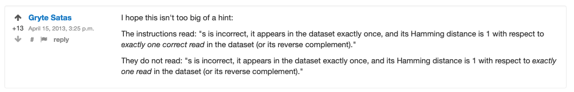

[This](https://rosalind.info/problems/corr/) problem asks:

> **Given**: A collection of up to 1000 reads of equal length.

> **Return**: A list of all corrections in the form "[old read]->[new read]".

<!--break-->

# References
1. [Python remove from list](https://www.w3schools.com/python/python_lists_remove.asp)
2. [Python dictionaries](https://www.w3schools.com/python/python_dictionaries.asp)
3. [How to print variables without spaces between values](https://stackoverflow.com/questions/28669459/how-to-print-variables-without-spaces-between-values)

# Restate the problem
I'm going to set a DNA strands that fall into two groups:

First, correct reads that are confirmed by being in the dataset more than once, either directly or via reverse complement. 

Second, incorrect reads, which only appear in the dataset one time. 

For each incorrect read, there is a correct read that requires exactly one character change to match the incorrect read. 

I need to return each incorrect read with its corresponding correct read.

# Solution steps
First, I wrote a function to find all the incorrect reads from the list of reads by removing every string that appeared more than one time either directly or as a reverse complement. That function looked like this:

```python
def find_bad_reads(seqs):
    good_reads = []
    bad_reads = []
    for s in seqs:
        bad_reads.append(s)
    for i in range(len(seqs)):
        for j in range(len(seqs)):
            if i != j:
                if seqs[i] == seqs[j]:
                    if i not in good_reads:
                        good_reads.append(i)
                if seqs[i] == Seq.reverse_complement(seqs[j]):
                    if i not in good_reads:
                        # print(sequences[i], " is the reverse complement of ", sequences[j])
                        good_reads.append(i)
    good_reads.sort(reverse = True)
    for k in good_reads:
        del bad_reads[k]
    return bad_reads
```

Then, I wrote a function to find all the correct reads by keeping only those reads that appear more than once, either directly or as a reverse complement.

```python
def find_good_reads(seqs):
    good_reads = []
    result = []
    for i in range(len(seqs)):
        for j in range(len(seqs)):
            if i != j:
                if seqs[i] == seqs[j]:
                    if i not in good_reads:
                        good_reads.append(i)
                if seqs[i] == Seq.reverse_complement(seqs[j]):
                    if i not in good_reads:
                        # print(sequences[i], " is the reverse complement of ", sequences[j])
                        good_reads.append(i)
    for k in good_reads:
        result.append(seqs[k])
    return result
```

Next, I wrote a function to find the match each incorrect read with a correct read or its reverse complement that differed by exactly one character.

```python
def corrections(errors, corrects):
    for a in range(len(corrects)):
        corrects.append(Seq.reverse_complement(corrects[a]))
    # print(corrects)
    response = {}
    for s in errors:
        for t in corrects:
            if hamm(s, t) == 1:
                # print(s, "->", t)
                response.update({s: t})
    return response
```

My answers were incorrect for the sample dataset, but I couldn't make any progress troubleshooting with the sample dataset, so I submitted two incorrect answers in order to unlock the "Questions" section, where I got the hint that incorrect responses shouldn't map to other incorrect responses, which was a case I allowed.

Once I fixed that, I got a successful result on my first attempt.

# Python concepts
I used a [Python dictionary](https://www.w3schools.com/python/python_dictionaries.asp) to store the list of corrections because I wanted to take advantage of the dictionary property of not allowing duplicates.

# Post-solution notes
**Challenges solved so far:** 48

**How many people solved this before me:** 2,410

**Time spent on challenge:** 1.5 hours of focused work over two days

**Most time-consuming facet:** Not allowing incorrect reads to match other incorrect reads

**Questions from others:** This is the hint that led to my being able to solve this challenge:



**Solutions from others:** I saw several cases of posted responses with notes that they had run into the same issue I had with matching incorrect reads with other incorrect reads.

I also saw solutions made a list of correct reads by simply removing all the bad reads from the list instead of writing a function to find all the good reads based on their appearing more than once like I did. Their approach is much simpler.

**Closing thoughts:** My code is extremely inefficient. The challenge dataset had 960 DNA reads of 50 base pairs each. My code takes **28 seconds** to produce the correct result. 378 of the 960 reads in my dataset were incorrect.