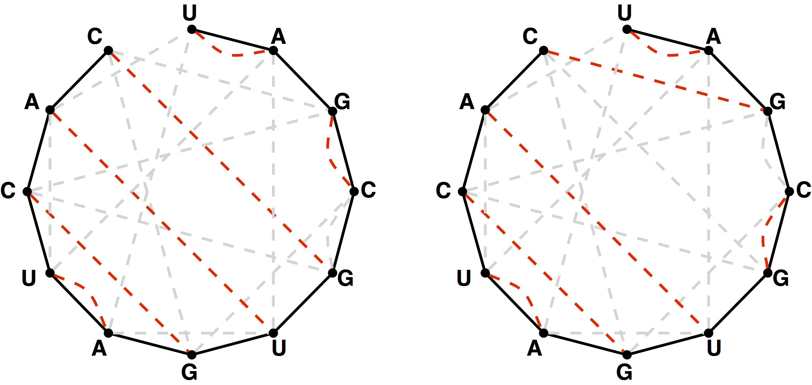

[Figure 3 from this challenge on Project Rosalind](https://rosalind.info/media/problems/cat/noncrossing_bonding_perfect.png)

[This](https://rosalind.info/problems/cat/) problem asks:

> **Given**: An RNA string _s_ having the same number of occurrences of 'A' as 'U' and the same number of occurrences of 'C' as 'G'.

> **Return**: The total number of noncrossing perfect matchings of basepair edges in the bonding graph of _s_, modulo 1,000,000.

<!--break-->

# References
1. [Noncrossing mathing](https://rosalind.info/glossary/noncrossing-matching/)
2. [Motzkin numbers](https://rosalind.info/glossary/motzkin-numbers/)
3. [More on Motzkin numbers](https://en.wikipedia.org/wiki/Motzkin_number)
4. [Catalan numbers](https://rosalind.info/glossary/catalan-numbers/)
5. [More on Catalan numbers](https://en.wikipedia.org/wiki/Catalan_number)
6. [More on Catalan numbers](https://oeis.org/A000108)

# Restate the problem
I'm going to get an RNA sequence where the count or A equals the count of U. Also, the count of C equals the count of G. I need to return the count of noncrossing perfect matchings for the bonding graph of _s_, mod 1,000,000.

There's also a hint with this challenge:

> Write a function that counts Catalan numbers via dynamic programming. How can we modify this function to apply to our given problem?

# Solution steps
First, the equation on the Wikipedia page for Catalan numbers gives the formula for calculating Catalan numbers.

I wrote a recursive function to calculate the Catalan numbers, then tried the Catalan number for half of the length of the RNA sequence, which gave the correct result for the sample dataset, but gave an incorrect result for a large dataset.

I wrote a function to return the greater of the counts of "A"-"U" characters in the string versus the count of "G"-"C" characters in the string and tried that Catalan number, but again, the result for the sample dataset was correct, but the result for a real dataset was incorrect.

Two incorrect responses unlocked the "Questions" area of Project Rosalind for this challenge.

After reading the questions and answers there, I tried:

> print(cat(2*maxchar(s))%1000000)

That response was also incorrect.

One of the hints in the Questions section is:

> My answer for CGGCUGCUACGCGUAAGCCGGCUGCUACGCGUAAGC is 736

So I tried every possible combination of adding, subtracting, multiplying, and dividing all Catalan numbers up to Catalan 50 (1,978,261,657,756,160,653,623,774,456), but never had a result of 736, and 736 is not a Catalan number itself, so that seemed to rule out the naive assumption that the correct result is a simple operation of two Catalan numbers.

I re-read the problem slowly several times and spent a lot of time looking at figure 3, shown above.

I realized that the **order** of the nodes makes a difference in how many noncrossing perfect matchings are possible.

Figure 3 shows that the number of noncrossing perfect matchings for 'UAGCGUGAUCAC' is 2.

I wrote a function to list all the possible pairings for a string.

I wrote a function to take all the possible pairings and return only the complete ones.

I wrote a function to take all the complete pairings and return only the non-crossing ones.

This combination of functions returned the correct result for small datasets, but took far too long on real datasets to be of any use.

The part that takes too long is considering all the possible pairings and returning only the complete ones.

I worked for a day and a half on a quick way to generate a list of complete pairings from a list of all pairings.
 
Finally, I decided to start looking at posted answers for clues. I checked:
1. [cdeterman's answer](https://github.com/cdeterman/Rosalind/blob/master/033_CAT/033_CAT.py): I studied this solution in depth. They use a global cache and a recursive function to identify a count of noncrossing complete matches without specifically listing them all.
2. [This reddit article](https://www.reddit.com/r/bioinformatics/comments/k87ckl/catalan_numbers_and_rna_secondary_structures_help/): included one helpful text hint a link to the Nussinov algorithm.
3. [Nussinov algorithm](https://en.wikipedia.org/wiki/Nussinov_algorithm): this approach includes building a martix of scores for optimal foldings of subsequences. Then, there is a traceback function to read the back all the possible paired bases.
4. [RNA pseudoknots](https://en.wikipedia.org/wiki/Pseudoknot): I read this because pseudoknots are mentioned in the challenge, but I don't think I learned anything directly applicable to a solution.
5. [Ruth Nussinov](https://en.wikipedia.org/wiki/Ruth_Nussinov): proposed the Nussinov algorithm in 1978.
6. [Zong Hui's answer](https://github.com/zonghui0228/rosalind-solutions/blob/master/code/rosalind_cat.py): Their code also calculates the number of noncrossing complete matches without calculating each one in full.
7. [Kaiwant0112006's answer](https://kaiwang0112006.github.io/rosalind_solve/code/CatalanNumbersandRNASecondaryStructures/CatalanNumbersandRNASecondaryStructures.html): I learned a lot from reading this code very carefully. Specifically, I figured out how to use [memoization](https://en.wikipedia.org/wiki/Memoization) with [recursion](https://en.wikipedia.org/wiki/Recursion) to solve this challenge. What I was missing is that a global dictionary lives outside the recursion loop and gets built up by successful loops through the recursion.

I removed all of my code that attempted to count the number of noncrossing complete matches without specifically listing each one.

I used an approach similar to Kaiwant0112006 which solved the first dataset from Project Rosalind correctly.

# Post-solution notes
**Challenges solved so far:** 50

**How many people solved this before me:** 1,633

**Most recent solve before me:** yesterday

**Time spent on challenge:** more than 30 hours over 6 days

**Most time-consuming facet:** I wasted a lot of time before giving up on specifically enumerating each complete noncrossing matching. In retrospect, I should have given up on that a lot sooner, since even an efficient method of enumerating each complete noncrossing matching would take far too long for this challenge.

**Questions from others:** The questions were helpful in two ways. First, they alerted me to the fact that simple, naive solutions would not work. Second, they provided a second sample dataset that was bigger than the one given in the challenge, but not as big as a challenge dataset.

**Solutions from others:** Most of the posted solutions used the same method that I used for this challenge, although many of them were more elegant and succinct than mine.

**Closing thoughts:** I would have benefited from giving up on my [naive](https://en.wikipedia.org/wiki/Informal_mathematics) approach earlier, but I was convinced that I was making progress toward a solution, so I kept going. In fact, I would never have reached a correct result with the method I was struggling to implement.