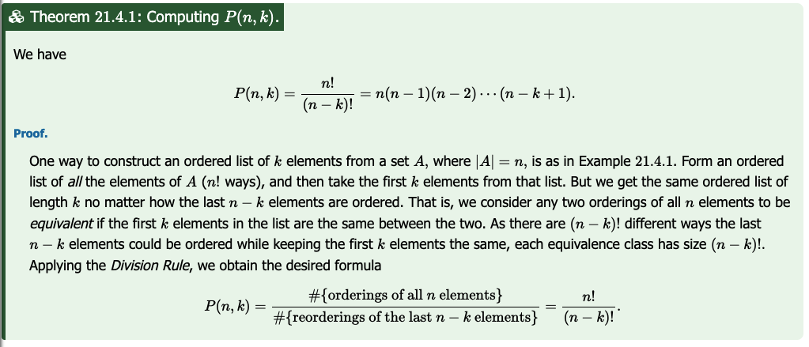

Screenshot of Project Rosalind not working.

[This](https://rosalind.info/problems/mmch/) problem asks:

> **Given**: An RNA string _s_ of length at most 100.

> **Return**: The total possible number of maximum matchings of basepair edges in the bonding graph of _s_.

<!--break-->

# References
1. [Graph theory on matching](https://en.wikipedia.org/wiki/Matching_(graph_theory)#Definition)

# Restate the problem
From the given RNA strand, I need to return the count of the maximum matchings possible in that bonding graph.

# Solution steps
First, I wrote a function to count the bases in the given RNA string.

Next, I wrote a function to determine the length of the maximum matchings available by adding the number of possible simultaneous AU pairs to the number of possible simultaneous GC pairs. 

Then, I wrote a function to count to total possible arrangements of maximum length by multiplying the number of all possible AU pairs by the number of all possible GC pairs.

My count_max_matchings function, shown below, returned the correct result for the sample dataset.

```python
def count_max_matchings(s):
    mydict = (count_bases(s))
    au_pairs = max(mydict['A'], mydict['U'])
    cg_pairs = max(mydict['C'], mydict['G'])
    return au_pairs * cg_pairs
```

When I tried my code against a real dataset, Project Rosalind crashed! See screenshot at the top of this article.

The site was completely unreachable!

I took a few deep breaths and tried again.

The site came back up.

I got my dataset, ran my program, submitted my result and got the red "Wrong!" banner.

I thought about my code, then realized that I needed to multiply all four dictionary values together to get the total number of possible matchings, which led to the code below:

```python
def count_max_matchings(s):
    mydict = (count_bases(s))
    return mydict['A'] * mydict['U'] * mydict['C'] * mydict['G']
```

This was also incorrect. My second incorrect response unlocked the Questions section of the problem, where I read about the struggles of others.

I reread the Wikipedia article on [graph theory matching](https://en.wikipedia.org/wiki/Matching_(graph_theory)#Definition), where I learned:

>Every maximum matching is maximal, but not every maximal matching is a maximum matching.

I'm not sure what that means, but I do feel confident that the A-U pairings and the C-G pairings are independent and will be multiplied by each other to get the result.

Away from the keyboard, I had the idea that the count of possible maximum matches for either half of the problem was the same as the size of the count of the more plentiful base in that half [choose](https://math.libretexts.org/Bookshelves/Combinatorics_and_Discrete_Mathematics/Elementary_Foundations%3A_An_Introduction_to_Topics_in_Discrete_Mathematics_(Sylvestre)/21%3A_Permutations/21.04%3A_Permutations_of_Subsets) the count of the least plentiful base in that half of the problem.



Explanation of P(n,k) from [math.libretexts.org](https://math.libretexts.org/Bookshelves/Combinatorics_and_Discrete_Mathematics/Elementary_Foundations%3A_An_Introduction_to_Topics_in_Discrete_Mathematics_(Sylvestre)/21%3A_Permutations/21.04%3A_Permutations_of_Subsets)

I implemented this equation in steps like this:

```python
def count_max_matchings(s):
    mydict = (count_bases(s))
    au_max = max(mydict['A'], mydict['U'])
    au_min = min(mydict['A'], mydict['U'])
    cg_max = max(mydict['C'], mydict['G'])
    cg_min = min(mydict['C'], mydict['G'])
    au_count = fact(au_max) // fact(au_max-au_min)
    cg_count = fact(cg_max) // fact(cg_max-cg_min)
    return au_count*cg_count
```

I used my own factorial function from the "[Perfect Matchings and RNA Secondary Structures](https://rosalind.info/problems/pmch/)" challenge, shown below.

```python
def fact(n):
    if n < 2:
        return 1
    else:
        return n * fact(n - 1)
```

My algorithm worked for sample datasets, and returned a correct result for the real dataset as well. The number of maximum matchings escalates quickly for larger datasets. For example, my dataset RNA string was 92 base-pairs long and the number of maximum matchings was 668,326,769,467,589,022,464,821,184,293,345,689,600,000,000.

Fortunately for me, Python 3 [handles arbitrary precision integers extremely well](https://www.askpython.com/python/examples/python-large-integer-handling), so working with values this big does not cause issues.

# Post-solution notes
**Challenges solved so far:** 51

**How many people solved this before me:** 1,878

**Most recent solve before me:** yesterday

**Time spent on challenge:** 90 minutes spread over two days

**Most time-consuming facet:** recognizing the situation as a case of the [choose](https://en.wikipedia.org/wiki/Combination) function.

**Questions from others:** The Questions section was helpful because it helped me see how this was a combinations counting situation.

**Solutions from others:** As always, other solvers wrote concise, easy-to-read code. Everyone used the same basic technique.

**Closing thoughts:** This challenge introduced new concepts without being overwhelming, my favorite kind.