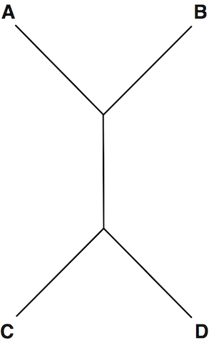

A simple tree that can be represented in Newick format as: (C, D, (A, B)); (A, (D, C), B); and (((A, B), C), D)

[This](https://rosalind.info/problems/nwck/) problem asks:

> **Given**: A collection of _n_ trees (_n_≤40) in Newick format, with each tree containing at most 200 nodes; each tree _Tk_ is followed by a pair of nodes _xk_ and _yk_ in _Tk_

> **Return**: A collection of _n_ positive integers, for which the *k*th integer represents the distance between _xk_ and _yk_ in _Tk_.

<!--break-->

# References
1. [Newick format](https://rosalind.info/glossary/newick-format/)
2. [More on Newick format](https://en.wikipedia.org/wiki/Newick_format)
3. [Newick, Python module to read and write the Newick format](https://pypi.org/project/newick/)
4. [Neighbors](https://rosalind.info/glossary/neighbor/)
5. [Clades](https://en.wikipedia.org/wiki/Clade)
6. [Sir Julian Huxley](https://en.wikipedia.org/wiki/Julian_Huxley)

# Restate the problem
I'm going to get a set of Newick format trees. With each tree, I'm also going to get two target nodes, and I need to calculate the distance between the two target nodes in the given tree.

# Solution steps
First, I read the documentation for the [newick module for Python](https://pypi.org/project/newick/). I decided to use it because it's a good fit for this challenge.

I was able to create trees with the newick module, but I failed to write my own function to traverse the resulting tree and calculate distance between two nodes, so I abandoned the newick module and started using [Phylo from Biopython](https://biopython.org/wiki/Phylo).

The Phylo library includes a distance function, but that only worked after I went through the tree and set the branch lengths for every branch to 1 as shown here:

```python
for clade in clades:
    clade.branch_length = 1
```

Once that was in place, I was able to find the distance between the two target nodes with:
```python
distance = thistree.distance(tree[1][0], tree[1][1])
```

My code returned a correct result for the full dataset on my first attempt. I spent about 2.5 hours on this challenge. I was the first person to solve this one in four days. 1,205 people solved this before me. I spent 2.5 hours on this.

After solving, I looked at the solutions of others and found an extremely clever method that calculated the distance between the two nodes without building the tree at all! They traverse the raw notation and count the number of times they cross parentheses and commas, which gives the correct result.