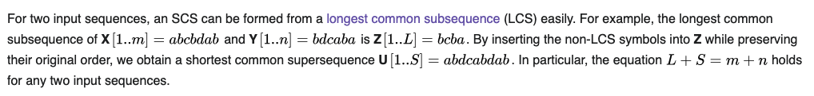

[This](https://rosalind.info/problems/scsp/) problem asks:

> **Given**: Two DNA strings _s_ and _t_.

> **Return**: A shortest common supersequence of _s_ and _t_.

<!--break-->

# References
1. [Supersequence](https://rosalind.info/glossary/supersequence/)
2. [Common supersequence](https://rosalind.info/glossary/common-supersequence/)
3. [Shortest common supersequence](https://rosalind.info/glossary/shortest-common-supersequence/)
4. [More on shortest common supersequence](https://en.wikipedia.org/wiki/Shortest_common_supersequence)
5. [Set cover problem](https://en.wikipedia.org/wiki/Set_cover_problem#Weighted_set_cover)
6. [Subsequence](https://en.wikipedia.org/wiki/Subsequence)

# Restating the problem
Given two strings, I need to find the shortest possible string that has both of the given strings as subsequences. A subsequence is one that can be created by deleting some or none of the characters from the given sequence. Another way to think of subsequences is that they contain the same symbols in the same order as the given string, but not necessarily consecutively.

# Solution steps
I read in Wikipedia that this problem is closely related to the [longest common subsequence problem we've already solved](https://rosalind.info/problems/lcsq/), so I [reviewed my code](https://github.com/rmbryan71/rosalind/blob/main/solution-code/lcsq.py) for that challenge.

I found this helpful hint on the Wikipedia page for [Shortest common supersequence](https://en.wikipedia.org/wiki/Shortest_common_supersequence):

I focused on this phrase for a while:

> By inserting the non-LCS symbols into _Z_ while preserving their original order, we obtain a shortest common supersequence...

Specifically, I wonder about: "... **preserving their original order**...". What can that mean?

I decided to try writing a shortest common supersequence function given two strings and their longest common subsequence, lcs.

First, I made an empty list, _scs_, to hold the shortest common supersequence.

Then, I added to _scs_ all the characters in _s_ up to the first _lcs_ character. Next, I added to _scs_ all the characters in _t_ up to the first _lcs_ character. Then, I added the first _lcs_ character.

I repeated that process until there were no more _lcs_ characters left to add.

To finish, I added any remaining characters from _s_ and _t_ to the _scs_.

This combination of steps returned the correct result for the sample dataset.

Success on the first attempt! I spent about 90 minutes on this challenge. 1,182 people have solved this before me. Nobody had solved this in a little over a week.

I unlocked two Project Rosalind badges with this result. Level 4 String Algorithms for solving 20 of the 26 string algorithm problems in the set, and Level 2 Dynamic Programming for solving 10 of the 23 dynamic programming problems in the set.