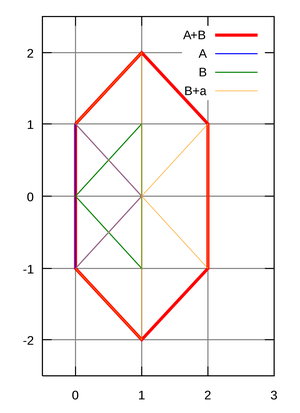
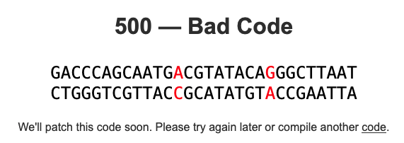

[Minkowski sum image from Project Rosalind.](https://rosalind.info/glossary/minkowski-sum/)

[This](https://rosalind.info/problems/conv/) problem asks:

> **Given**: Two multisets of positive real numbers _S1_ and _S2_.

> **Return**: The largest multiplicity of _S1⊖S2_, as well as the absolute value of the number _x_ maximizing _(S1⊖S2)(x)_

<!--break-->

# References
1. [Multiset](https://en.wikipedia.org/wiki/Multiset)
2. [Bhaskara II](https://en.wikipedia.org/wiki/Bh%C4%81skara_II)
3. [Multiplicity](https://rosalind.info/glossary/multiplicity/)
4. [Minkowski sum](https://rosalind.info/glossary/minkowski-sum/)
5. [Minkowski addition](https://en.wikipedia.org/wiki/Minkowski_addition)
6. [Hermann Minkowski](https://en.wikipedia.org/wiki/Hermann_Minkowski)
7. [Spectral convolution](https://rosalind.info/glossary/spectral-convolution/)

# Restating the problem
Given two multisets, I need to find the value that appears most often in their multiset difference. Then, I need to find the absolute value of the greatest multiset difference between the two multisets.

# Solution steps
First, I wrote a mink_diff function with these nested loops:

```python
def mink_diff(S1, S2):
    result = []
    for s1 in S1:
        for s2 in S2:
            result.append(round(s1 - s2, 5))
    return result
```

Then, I wrote this function to find the maximum multiplicty in a given multiset with:

```python
def max_multiplicity(mylist):
    item = max(mylist, key=mylist.count)
    return mylist.count(item)
```

Finally, I wrote this function to find the most common absolute value in a multiset:

```python
def max_diff(mylist):
    newlist = []
    for item in mylist:
        newlist.append(abs(item))
    return max(newlist, key=newlist.count)
```

These three functions combined to give the correct response for the sample dataset.
When I downloaded a real dataset from Project Rosalind, the site crashed when I submitted my response.



A few minutes later, I tried again and got a correct result response. I spent about 60 minutes on this challenge. 1,162 people solved this before me. This is my 61st correct response.