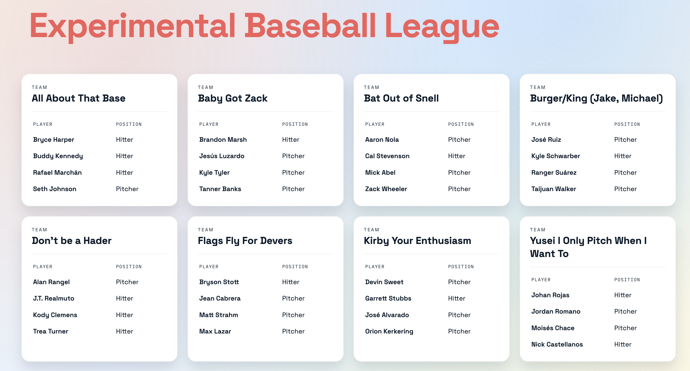
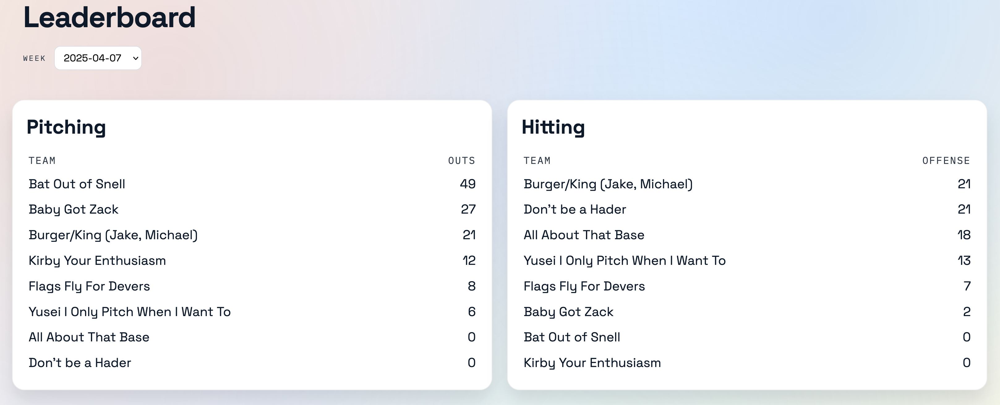

# Introduction
This is where I keep track of what I'm thinking and doing.

# January 14, 2026
4:30 PM - This is my list of things I want to work on in rough priority order:
1. Web layout that looks good on cell - done
2. Scoring that goes weekly instead of whole season at once - done
3. Database persistence - done
4. Load 2025 season data into prod - done
5. Web view of audit trail - done
5. User accounts - 
6. Authentication
7. Roster moves
8. Move the rules into the app
8. Admin panel
9. Permanent hosting
9. Auction automation
10. Multiple leagues
11. Public Sign Up
12. Non-Phillies teams 
13. AI bots that participate in auctions  

6:05 PM - I'm satisfied with the web app overhaul to make it cell friendly.  
6:35 PM - In the future, should remember to put the server in maintenance mode before pushing experimental code.  
6:45 PM - I've migrated from SQLite to Postgres in prod. The new web layout looks good on cell.
7:02 PM - I've loaded all 2025 season stats into the prod db and run scoring. Everything looks good.
7:50 PM - I might need to install Postgres locally. That might actually be simpler than having two different database types.  
I also need automated testing.  
8:00 PM - Installing Postgres locally and ripping out all the SQLite code.
8:55 PM - I should not have gone down the path of trying to run SQLite locally and Postgres on Render.
9:25 PM - My local environment is stable and running on Postgres.
9:35 PM - Troubleshooting db-init.py on Render. I need to remember to time-box future development sessions.  
9:45 PM - That's a wrap. The Render server is up and running with new data, looks good on cell.  
my Render Postgres DB is on the Free level, need to remember to upgrade it if it continues to work.  

# January 13, 2026
6:35 AM - Designing screens before work.

4:35 PM - Resolved some security vulnerabilities in the website thanks to [dependabot](https://docs.github.com/en/code-security/how-tos/secure-your-supply-chain/secure-your-dependencies/configuring-dependabot-security-updates).  
Drastically simplified the website by removing basically everything except the rules. Everything else was helpful in getting me started, but development is going so fast, just keeping the documentation up to date was slowing me down, so I cut it. I have a web front-end already, so I'm never going to serve the league as a set of texts lists, so we don't need stubs for where those lists will go.  
5:45 PM - I have a scoring function that awards points on Sunday night according to the rules and appears to handle ties correctly.  
6:45 PM - I have working prototypes of all the main screens.  
7:00 PM - Made a few last changes. I'm ready to have people look at this and give feedback. Working on deployment.  
7:30 PM - I am now a Render Professional license owner. The Experimental Baseball League, which was already operating at a loss because of my ChatGPT license, is now setting money on fire as quickly as we can light it up.  
7:40 PM - We are live to the world. Our url is: [https://ebl-k2sj.onrender.com/](https://ebl-k2sj.onrender.com/). Now updating the website and sending out comms.  
8:05 PM - I sent out an email to the league.

# January 12, 2026
5:30 AM - Fixed a few broken links and formatting annoyances on the website.  
Now I'm going to start adding triggers to the database so that all changes get written to the audit log.  
6:10 AM - AI is helpful. I'm using free ChatGPT. My [db-make.py](https://github.com/rmbryan71/ebl/blob/main/db-make.py) now creates triggers so that all table updates write to the audit trail.  Later, I might want to split db-make into schema, triggers, and indexes.  
6:40 AM - I'm working on a function to get player data from MLB and write it into my player table. There's a much better Python wrapper for the MLB API, but I need to upgrade Python to use it.  
6:56 AM - That worked well. I'm on Python 3.14 now. Upgraded to the latest PyCharm while I was at it.  
End session. Next time: Use the new Python wrapper to sync MLB API roster data to the players table.

3:50 PM - I upgraded to ChatGPT plus for $20/month. I use it for other things as well. It's been extremely helpful so far with coding, so the Experimental Baseball League is now operating at a loss.  
4:00 PM - Oooooh, my ChatGPT plus subscription comes with Codex that integrates right into the IDE, but not PyCharm... or wait, does it? This is probably worth doing. This is what I'm doing now.  
4:30 PM - Wow, okay. Wow. I have the Codex AI agent integrated into my IDE. It has read and understood the requirements I documented in the [EBL Constitution](/ebl/constitution.html). It understands how the MLB API works. It understands how my database works. It obviously knows how to do everything in Python.  
4:45 PM - My role is different now. I don't have to figure out how to do the things I want to do. It knows how to do everything. I just need to be clear about telling it exactly what I want.  
5:00 PM - This changes a lot. I don't have to limit myself to what I think I can code. That was holding me back. For now, I'm going to keep moving forward with my plan, but I'm open to the possibility that having AI available to do things for me means I can do different things, not just the same things faster.  
5:20 PM - This is going to take some getting used to.  
5:55 PM - More progress than I can summarize. I have a web front end now, running locally. Taking a break to walk and eat dinner.  

7:05 PM - I have roster-sync so that it asks for a date and sets the player table to that date.  
8:05 PM - I have a working web app that reads from my database and a prototype landing page.  
  
8:55 PM - I have a prototype of a leaderboard.  
  
The drop-down lets you select any week. All the data is from the database. All the queries work. I'm using 2025 stats for testing. Players are assigned randomly to EBL teams for testing. Team names are randomly assigned from a list of fantasy baseball team names I found online.  
That's it for today.

# January 11, 2026
Worked on documentation. Drastically simplified the [tech plan](/ebl/tech.html).  
It's time to make a [database](https://en.wikipedia.org/wiki/Database).  
All of my experience is with [Postgres](https://en.wikipedia.org/wiki/PostgreSQL).  
In this case, though, I'm going to start with [SQLite](https://en.wikipedia.org/wiki/SQLite) because:
1. It doesn't require a server.
2. It's simpler.
3. It's similar enough to Postgres that I'll be able to write SQL for it.

I'm going to invest an hour into installing and working with SQLite.  
An hour? More like, what, 8 minutes?  
That could not _possibly_ have been any easier.  
Cool. Okay, now what?  
[Database design](https://en.wikipedia.org/wiki/Database_design), probably.  
I'm working [here](/ebl/db-design.html).  
8:55 PM - Design is complete. I have a [db-make.py](https://github.com/rmbryan71/ebl/blob/main/db-make.py) that creates all the tables, fields, and foreign key constraints.  
Do I want my db file in git? Oh, it's binary, probably not.  

# January 10, 2026
I'm removing the .pdf's I used to launch the league before moving to the web.  
The website is okay for now.  
The rules have stabilized enough.  
I'm going to put an hour into trying to write a Python program to fetch the Phillies 40-man roster from the MLB API and write that data to a local text file that gets served to the website. No database. Wipe any previous results, replace with the new results.  
1. I started a [fresh Python project](https://github.com/rmbryan71/ebl).
2. I registered for an MLB Advanced Media API account. They're going to review my application.  
3. I found a [Python wrapper for the MLB API](https://github.com/toddrob99/MLB-StatsAPI).
4. I made a request and got data. Didn't need an account.
5. I got the [current Phillies 40-man roster](https://www.mlb.com/phillies/roster/40-man) and [wrote it to a file](/ebl/40-man-roster.html).  

That was easy.